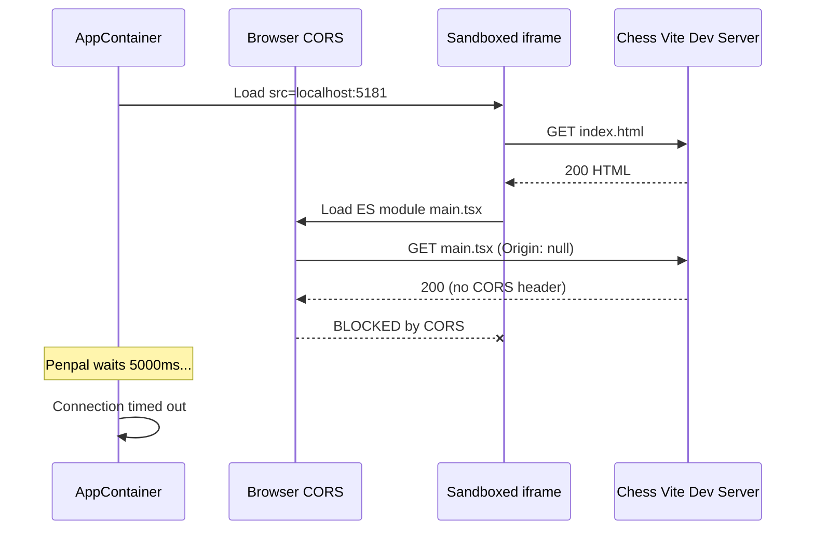

# Fix Penpal Connection Timeout (CORS + Port Mismatch)

## Root Cause

Two issues compound into the 5000ms timeout:

1. **Port mismatch**: `apps/chess/manifest.json` has `entry_url: "http://localhost:5181"` but the Vite dev server runs on port `5174` (per `apps/chess/vite.config.ts`).
2. **Sandbox origin**: The iframe in `[app/src/components/apps/AppContainer.tsx](app/src/components/apps/AppContainer.tsx)` line 211 has:

```
   sandbox="allow-scripts allow-forms allow-popups allow-popups-to-escape-sandbox"
   

```

   Without `allow-same-origin`, the iframe's origin becomes `null`. ES module `<script type="module">` loading requires CORS. Vite dev server doesn't send `Access-Control-Allow-Origin: *` by default, so all module loads (`@react-refresh`, `client`, `main.tsx`) are blocked. The React app never mounts, Penpal child never calls `connect()`, parent times out.

   The Phase 4 spike test used a relative `entry_url: "/test-app.html"` (same-origin), so it never hit this path.




## Fix 1: Port mismatch in manifest

In `[apps/chess/manifest.json](apps/chess/manifest.json)`, change `entry_url` from `http://localhost:5181` to `http://localhost:5174` to match the Vite dev server port.

## Fix 2: Add `allow-same-origin` to iframe sandbox

In `[app/src/components/apps/AppContainer.tsx](app/src/components/apps/AppContainer.tsx)` line 211, change:

```
sandbox="allow-scripts allow-forms allow-popups allow-popups-to-escape-sandbox"
```

to:

```
sandbox="allow-scripts allow-same-origin allow-forms allow-popups allow-popups-to-escape-sandbox"
```

This restores the iframe's real origin (e.g. `http://localhost:5174`), making ES module loading work normally -- no CORS needed since the resources are same-origin from the iframe's perspective.

**Security tradeoff**: `allow-scripts` + `allow-same-origin` together technically allows the iframe JS to remove its own sandbox. This is fine for registered/approved apps (which ChatBridge requires). For reference, this is the same model Figma plugins and Notion embeds use. If stricter isolation is desired later, the alternative is requiring every app server to send `Access-Control-Allow-Origin: `* headers and keeping the sandbox without `allow-same-origin`.

## Fix 3 (belt-and-suspenders): CORS headers on chess Vite dev server

In `[apps/chess/vite.config.ts](apps/chess/vite.config.ts)`, add explicit CORS config so the dev server works even in edge cases:

```ts
server: {
  port: 5174,
  cors: true,
}
```

This is optional if Fix 2 is applied, but protects against future regressions or configurations where `allow-same-origin` might be removed.

## After re-registering

After fixing the manifest, re-register the chess app so the updated `entry_url` propagates to KV + D1:

```bash
curl -X POST http://localhost:5173/api/apps/register \
  -H "Authorization: Bearer $TOKEN" \
  -H "Content-Type: application/json" \
  -d @apps/chess/manifest.json
```

## Files changed

- `[apps/chess/manifest.json](apps/chess/manifest.json)` -- fix `entry_url` port
- `[app/src/components/apps/AppContainer.tsx](app/src/components/apps/AppContainer.tsx)` -- add `allow-same-origin` to sandbox
- `[apps/chess/vite.config.ts](apps/chess/vite.config.ts)` -- add `cors: true` (optional)

