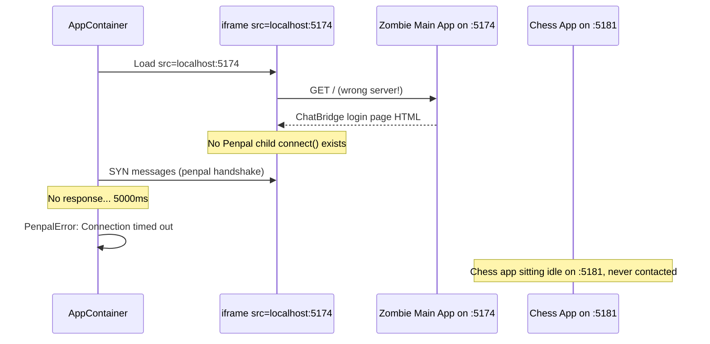

# Fix Penpal Timeout: Zombie Process Port Collision

## Root Cause

You have **6+ stale Vite dev server instances** running from previous sessions. They occupy ports 5173 through 5180:


| Instance | Port | Notes |
| -------- | ---- | ----- |


- Main app (pid 30743, ~5hrs old): port 5177
- Main app (pid 32677, ~2hrs old): port 5180 -- also logged "Invalid hook call" / duplicate React errors
- Chess (pid 89567): tried 5174-5180, all taken, landed on **port 5181**
- Unknown zombie processes are squatting on 5173, 5174, 5175, 5176 (not visible in terminals)

The manifest says `entry_url: "http://localhost:5174"`. Port 5174 is occupied by a **zombie main app instance** (not the chess app). So the iframe loads the main ChatBridge app inside itself -- that page has no Penpal child-side `connect()` call, and the handshake times out after 5s.




## Fix (3 parts)

### 1. Kill all zombie processes, restart clean

Kill every node/Vite process in the chatbridge tree, then start exactly two servers:

- Main app on **5173**
- Chess on **5174**

```bash
pkill -f "chatbridge/chatbox.*vite" || true
# wait a sec for ports to release, then:
cd app && npm run dev          # should get 5173
cd apps/chess && npm run dev   # should get 5174
```

### 2. Add `strictPort: true` to chess Vite config

In `[apps/chess/vite.config.ts](apps/chess/vite.config.ts)`, add `strictPort: true` so Vite **fails with an error** if port 5174 is already in use, instead of silently picking another port:

```ts
server: {
  port: 5174,
  strictPort: true,
  cors: true,
}
```

This way, the next time a zombie grabs 5174, the chess server will refuse to start with a clear error message, instead of silently serving on 5181 while the manifest points to 5174.

### 3. Stabilize the chess child-side Penpal effect (secondary)

The chess app's `useEffect` that calls `connect()` has 5 callback dependencies:

```391:391:apps/chess/src/App.tsx
  }, [handleStartGame, handleMakeMove, handleGetBoardState, handleAnalyzePosition, getStateSummary]);
```

Although these are currently stable (all transitively depend on empty arrays or stable refs), this is fragile. If any game state leaks into those deps in a future change, the effect would re-run, destroying and recreating the Penpal connection mid-handshake.

Fix: store the handler functions in refs and reduce the effect's deps to `[]`, matching the pattern already used on the parent side in `AppContainer.tsx`. This makes the Penpal connection immune to React re-renders.

## Files changed

- `apps/chess/vite.config.ts` -- add `strictPort: true`
- `apps/chess/src/App.tsx` -- move tool handlers to refs, reduce Penpal useEffect deps to `[]`
- Process cleanup (kill zombies, restart servers)

