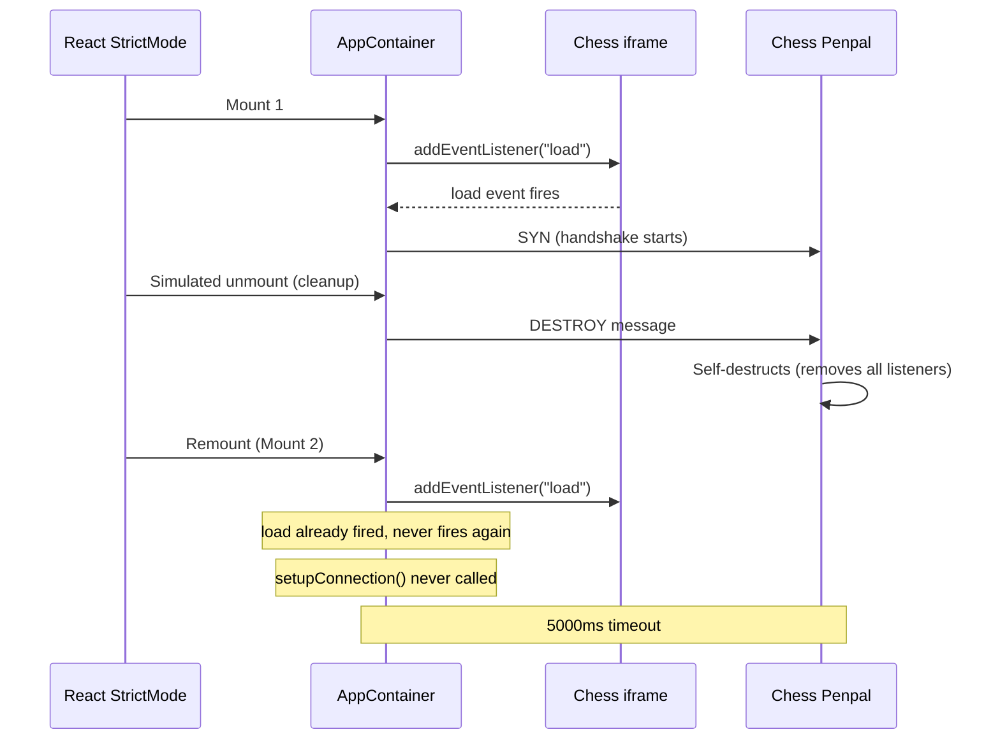

# Fix Penpal Timeout: React StrictMode Double-Mount

## Root Cause

The platform wraps the app in `<StrictMode>` (`[app/src/main.tsx](app/src/main.tsx)` line 9). In React 18 dev mode, StrictMode simulates unmount/remount for every component. This kills the Penpal connection:




## Fix: Three changes to `AppContainer.tsx`

### 1. Stabilize `setupConnection` with callback refs

Currently `setupConnection` depends on `[manifest, sessionId, onStateUpdate, onCompletion]`. The callback props (`onStateUpdate`, `onCompletion`) change when `ChatPage` re-renders, which can cause the `useEffect` to re-run and destroy the connection mid-handshake.

Store callbacks in refs so `setupConnection` only depends on `[manifest, sessionId]`:

```tsx
const onStateUpdateRef = useRef(onStateUpdate);
const onCompletionRef = useRef(onCompletion);
onStateUpdateRef.current = onStateUpdate;
onCompletionRef.current = onCompletion;
```

Then inside `setupConnection`, use `onStateUpdateRef.current(s)` instead of `onStateUpdate(s)`.

### 2. Delayed destroy for StrictMode resilience

Instead of destroying the Penpal connection synchronously in the effect cleanup (which sends DESTROY to the child), defer it with a ~100ms timeout. On StrictMode remount, cancel the pending destroy.

```tsx
const destroyTimerRef = useRef<ReturnType<typeof setTimeout>>(null);
const iframeLoadedRef = useRef(false);

useEffect(() => {
  // Cancel pending destroy from StrictMode unmount
  if (destroyTimerRef.current) {
    clearTimeout(destroyTimerRef.current);
    destroyTimerRef.current = null;
  }

  const iframe = iframeRef.current;
  if (!iframe) return;

  const handleLoad = () => {
    iframeLoadedRef.current = true;
    setupConnection();
  };

  iframe.addEventListener("load", handleLoad);

  // StrictMode remount: iframe already loaded, reconnect immediately
  if (iframeLoadedRef.current && !connectionRef.current) {
    setupConnection();
  }

  return () => {
    iframe.removeEventListener("load", handleLoad);
    // Delay destroy so StrictMode remount can cancel it
    destroyTimerRef.current = setTimeout(() => {
      connectionRef.current?.destroy();
      connectionRef.current = null;
      appMethodsRef.current = null;
    }, 100);
  };
}, [setupConnection]);
```

This way:

- **StrictMode**: cleanup queues a destroy, remount cancels it within 100ms -- connection survives
- **Real unmount**: cleanup queues a destroy, no remount -- connection is destroyed after 100ms

### 3. Signal readiness after Penpal connects, not on mount

Currently `appContainerReadyAtom` is set to `true` in the ref callback (`handleContainerRef` in `[ChatPage.tsx](app/src/pages/ChatPage.tsx)` line 29), which fires when the component mounts -- **before the Penpal handshake completes**. This causes `useAppBridge` to invoke tools against a null `appMethodsRef`, returning "App not connected".

Add an `onReady` callback prop to `AppContainer` and fire it from the `.then()` handler of `conn.promise`:

In `[app/src/components/apps/AppContainer.tsx](app/src/components/apps/AppContainer.tsx)`:

- Add `onReady?: () => void` to `AppContainerProps`
- Call `onReady?.()` inside `conn.promise.then()` after `setState("connected")`

In `[app/src/pages/ChatPage.tsx](app/src/pages/ChatPage.tsx)`:

- Add `handleReady` callback that sets `containerReady(true)`
- Remove `setContainerReady(!!handle)` from `handleContainerRef`
- Pass `onReady={handleReady}` to `AppContainer`

## Files changed

- `[app/src/components/apps/AppContainer.tsx](app/src/components/apps/AppContainer.tsx)` -- callback refs, delayed destroy, `onReady` prop
- `[app/src/pages/ChatPage.tsx](app/src/pages/ChatPage.tsx)` -- move `setContainerReady` to `onReady` callback

