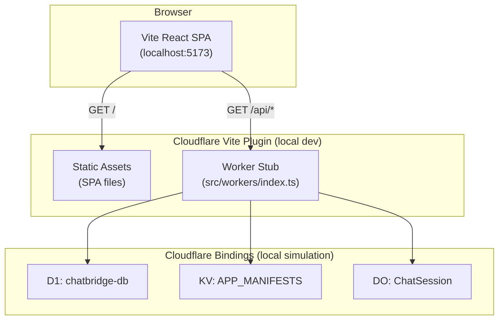

# Phase 0: ChatBridge Project Setup

## Starting State

The repo at `/Users/n0destradamus/chatbridge/chatbox` is a fork of the Chatbox Electron app. It uses `pnpm`, `electron-vite`, and has the standard Chatbox structure (`src/renderer/`, `src/main/`, etc.). There is **no** `app/` directory, no `wrangler.jsonc`, and no Cloudflare configuration.

We will scaffold a **completely separate** Vite + React project in `app/` that ignores the Electron build chain and uses `npm` (matching the build guide).

---

## Step 0.1 -- Verify Fork and Upstream Remote

The repo is already cloned. Just verify the upstream remote is set:

```bash
cd /Users/n0destradamus/chatbridge/chatbox
git remote -v
# If upstream is missing:
git remote add upstream https://github.com/chatboxai/chatbox.git
```

No code changes needed.

---

## Step 0.2 -- Scaffold Vite + React-TS in `app/`

From the repo root:

```bash
npm create vite@latest app -- --template react-ts
cd app
npm install
```

This creates `app/` with the standard Vite React-TS template. Verify with `cd app && npm run dev` -- should show the Vite welcome page at `http://localhost:5173`.

**Important:** The existing `pnpm-workspace.yaml` references `release/app` not `app`, so no workspace conflict.

---

## Step 0.3 -- Install Cloudflare Dependencies

From `app/`:

```bash
npm install @cloudflare/vite-plugin wrangler --save-dev
npm install -D @cloudflare/workers-types
```

---

## Step 0.4 -- Create `wrangler.jsonc`

Create `[app/wrangler.jsonc](app/wrangler.jsonc)` with all the bindings ChatBridge needs. Key decisions based on the [Cloudflare Vite plugin tutorial](https://developers.cloudflare.com/workers/vite-plugin/tutorial/) and [wrangler skill](https://developers.cloudflare.com/workers/wrangler/):

```jsonc
{
  "$schema": "./node_modules/wrangler/config-schema.json",
  "name": "chatbridge",
  "compatibility_date": "2026-04-01",
  "compatibility_flags": ["nodejs_compat_v2"],
  "main": "./src/workers/index.ts",
  "assets": {
    "not_found_handling": "single-page-application",
    "run_worker_first": ["/api/*", "/ws/*"]
  },
  "vars": {
    "CF_ACCOUNT_ID": "PLACEHOLDER",
    "AI_GATEWAY_ID": "chatbridge-gateway"
  },
  "d1_databases": [
    {
      "binding": "DB",
      "database_name": "chatbridge-db",
      "database_id": "PLACEHOLDER",
      "migrations_dir": "./migrations"
    }
  ],
  "kv_namespaces": [
    {
      "binding": "APP_MANIFESTS",
      "id": "PLACEHOLDER"
    }
  ],
  "durable_objects": {
    "bindings": [
      {
        "name": "CHAT_SESSION",
        "class_name": "ChatSession"
      }
    ]
  },
  "observability": {
    "enabled": true
  }
}
```

**Key deviations from the build guide worth noting:**

- `compatibility_flags` uses `nodejs_compat_v2` (current best practice) instead of the older `nodejs_compat`
- `assets.run_worker_first: ["/api/*", "/ws/*"]` is required so that API and WebSocket routes hit the Worker instead of being treated as static asset/SPA requests. The CF Vite plugin tutorial explicitly recommends this pattern.
- `main` points to `./src/workers/index.ts` (where we'll put the Hono-based Worker entry in Phase 1)
- `migrations_dir` is set on the D1 binding for `wrangler d1 migrations` to work
- `observability` is enabled for tail/logging from day 1

---

## Step 0.5 -- Create Cloudflare Resources (Interactive)

These commands require `wrangler login` and will output real IDs that must be pasted into `wrangler.jsonc`:

```bash
cd app

# Login to Cloudflare (if not already)
npx wrangler login

# Create D1 database -- copy the database_id from output
npx wrangler d1 create chatbridge-db

# Create KV namespace -- copy the id from output
npx wrangler kv namespace create APP_MANIFESTS

# Store secrets (interactive prompts)
npx wrangler secret put ANTHROPIC_API_KEY
npx wrangler secret put JWT_SECRET
```

After running these, replace `PLACEHOLDER` values in `wrangler.jsonc` with the real IDs. Also set `CF_ACCOUNT_ID` in `vars` to your actual account ID.

For **local dev**, create `app/.dev.vars`:

```
ANTHROPIC_API_KEY=sk-ant-...
JWT_SECRET=chatbridge-dev-secret-change-in-prod
CF_AIG_TOKEN=your-token-here
```

---

## Step 0.6 -- AI Gateway (Dashboard)

This is a manual step in the Cloudflare dashboard:

1. Go to dash.cloudflare.com -> AI -> AI Gateway
2. Create gateway named `chatbridge-gateway`
3. Enable authentication
4. Note the Gateway ID (should match `AI_GATEWAY_ID` var in wrangler.jsonc)
5. Store the gateway token: `npx wrangler secret put CF_AIG_TOKEN`

---

## Step 0.7 -- Configure `vite.config.ts`

Replace the scaffolded `[app/vite.config.ts](app/vite.config.ts)` with:

```typescript
import { defineConfig } from "vite";
import react from "@vitejs/plugin-react";
import { cloudflare } from "@cloudflare/vite-plugin";

export default defineConfig({
  plugins: [react(), cloudflare()],
});
```

The plugin auto-detects `wrangler.jsonc` in the project root. No explicit config needed.

---

## Step 0.8 -- TypeScript Config for Worker Code

Create `[app/tsconfig.worker.json](app/tsconfig.worker.json)`:

```json
{
  "extends": "./tsconfig.node.json",
  "compilerOptions": {
    "tsBuildInfoFile": "./node_modules/.tmp/tsconfig.worker.tsbuildinfo",
    "types": ["@cloudflare/workers-types/2023-07-01", "vite/client"]
  },
  "include": ["src/workers"]
}
```

Update `[app/tsconfig.json](app/tsconfig.json)` to add the worker reference:

```json
{
  "files": [],
  "references": [
    { "path": "./tsconfig.app.json" },
    { "path": "./tsconfig.node.json" },
    { "path": "./tsconfig.worker.json" }
  ]
}
```

---

## Step 0.9 -- Create Project Directory Structure

```bash
cd app
mkdir -p src/{components,hooks,lib,pages,stores,types,workers}
mkdir -p src/components/{chat,apps,auth,ui}
mkdir -p migrations
```

Target structure after Phase 0:

```
app/
  src/
    components/
      chat/          # Chat UI (Phase 3)
      apps/          # App iframe container (Phase 4)
      auth/          # Login/register (Phase 3)
      ui/            # Shared UI components
    hooks/           # React hooks (useChat, useApps, useAuth)
    lib/             # Utilities (api client, penpal helpers)
    pages/           # Route pages
    stores/          # Jotai atoms
    types/           # TypeScript interfaces
    workers/         # Cloudflare Worker entry + DO class
  migrations/        # D1 SQL migrations
  wrangler.jsonc
  vite.config.ts
  tsconfig.json
  tsconfig.worker.json
  .dev.vars          # Local secrets (git-ignored)
  package.json
```

---

## Step 0.10 -- Update `.gitignore` and Verify

Add to `app/.gitignore` (or the repo root `.gitignore`):

```
# Cloudflare
.wrangler/
.dev.vars*
```

Create a minimal `app/src/workers/index.ts` stub so the dev server can start:

```typescript
export default {
  fetch(request: Request): Response {
    return new Response("ChatBridge API");
  },
} satisfies ExportedHandler;
```

---

## Verification

After all steps:

```bash
cd app && npm run dev
```

- Vite dev server starts with Cloudflare Workers runtime messages
- `http://localhost:5173` serves the React SPA
- `curl http://localhost:5173/api/` hits the Worker stub (returns "ChatBridge API")

---

## Architecture After Phase 0




## Decisions and Gotchas

- **npm vs pnpm:** The `app/` directory uses `npm` (per build guide). The parent Chatbox repo uses `pnpm`. They are independent -- `app/` has its own `package.json` and `node_modules`.
- **Worker entry location:** The build guide puts the Worker at `src/workers/index.ts`. The CF tutorial puts it at `worker/index.ts`. We follow the build guide since the Worker code is tightly coupled with the SPA source and will share types from `src/types/`.
- `**run_worker_first`:** The build guide's wrangler.jsonc prompt omits this, but the CF Vite plugin tutorial shows it is needed for explicit API routing. Without it, API requests from non-navigation contexts rely on `Sec-Fetch-Mode` heuristics which can be unreliable. We add `["/api/*", "/ws/*"]`.
- `**nodejs_compat_v2`:** Supersedes the old `nodejs_compat` flag. Needed for Hono and Web Crypto usage in later phases.

