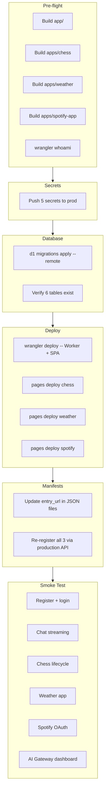

# Phase 10: Deploy

**Spec source:** [`.cursor/plans/chatbridgebuildguide.md`](.cursor/plans/chatbridgebuildguide.md) (lines 1120-1180).

## Prerequisites / pre-flight

Before any deploy commands, verify local state is clean:

- `cd app && npm run build` succeeds without errors (TypeScript + Vite)
- `cd apps/chess && npm run build`, `cd apps/weather && npm run build`, `cd apps/spotify-app && npm run build` all produce `dist/` dirs
- Wrangler is authenticated: `npx wrangler whoami` shows the correct account (`e4eb8966855fa9ef705bd36f8cc400c1`)
- All required secrets already set locally via `.dev.vars` — now need to be pushed to production

## Step 10.1 -- Set production secrets

Five secrets from [`.dev.vars.example`](app/.dev.vars.example) need to exist in the production Worker. Run from `app/`:

```bash
npx wrangler secret put ANTHROPIC_API_KEY
npx wrangler secret put JWT_SECRET
npx wrangler secret put CF_AIG_TOKEN
npx wrangler secret put SPOTIFY_CLIENT_ID
npx wrangler secret put SPOTIFY_CLIENT_SECRET
```

Each prompts interactively for the value. Use production-grade values (not dev placeholders) — especially `JWT_SECRET` should be a strong random string.

## Step 10.2 -- Apply D1 migration to production

From `app/`:

```bash
npx wrangler d1 migrations apply chatbridge-db --remote
```

This runs [`migrations/0001_initial.sql`](app/migrations/0001_initial.sql) against the remote D1 database (`6e60ba85-...`). Verify with:

```bash
npx wrangler d1 execute chatbridge-db --remote --command "SELECT name FROM sqlite_master WHERE type='table'"
```

Should list: `users`, `apps`, `conversations`, `messages`, `app_sessions`, `app_tokens`.

## Step 10.3 -- Deploy the platform Worker

From `app/`:

```bash
npx wrangler deploy
```

This builds (Vite + esbuild), uploads static assets + Worker bundle, and provisions the DO migration (tag `v1`, `ChatSession` SQLite class) if not already applied. The output prints the Worker URL, e.g. `https://chatbridge.<subdomain>.workers.dev`.

**Verify:** Visit the URL in a browser — the SPA login page loads (TanStack Router redirects `/` to `/login`).

## Step 10.4 -- Deploy the three sub-apps to Cloudflare Pages

Each sub-app is a plain Vite SPA deployed via `wrangler pages deploy`. Run from each app directory after `npm run build`:

**Chess:**
```bash
cd apps/chess
npm run build
npx wrangler pages deploy dist --project-name chatbridge-chess
```

**Weather:**
```bash
cd apps/weather
npm run build
npx wrangler pages deploy dist --project-name chatbridge-weather
```

**Spotify:**
```bash
cd apps/spotify-app
npm run build
npx wrangler pages deploy dist --project-name chatbridge-spotify
```

Each prints a `*.pages.dev` URL. Note all three. On first deploy, Wrangler prompts to create the Pages project — accept.

**Important for Spotify:** Update the Spotify Developer Dashboard redirect URI to `https://chatbridge.<subdomain>.workers.dev/api/oauth/spotify/callback` (replacing the localhost one, or adding alongside it).

## Step 10.5 -- Update app manifests with production URLs

All three manifests currently have `entry_url` pointing to `localhost`:

- [`apps/chess/manifest.json`](apps/chess/manifest.json) line 9: `"entry_url": "http://localhost:5174"`
- [`apps/weather/manifest.json`](apps/weather/manifest.json) line 9: `"entry_url": "http://localhost:5175"`
- [`apps/spotify-app/manifest.json`](apps/spotify-app/manifest.json) line 19: `"entry_url": "http://localhost:5176"`

**Two things to do:**

1. **Update the JSON files** in the repo so `entry_url` points to the deployed Pages URLs (e.g. `https://chatbridge-chess.pages.dev`). This keeps the repo accurate for anyone cloning.

2. **Re-register each manifest** against the production Worker so KV has the correct URLs:

```bash
TOKEN="<jwt-from-production-login>"
WORKER_URL="https://chatbridge.<subdomain>.workers.dev"

curl -X POST "$WORKER_URL/api/apps/register" \
  -H "Authorization: Bearer $TOKEN" \
  -H "Content-Type: application/json" \
  -d @apps/chess/manifest.json

curl -X POST "$WORKER_URL/api/apps/register" \
  -H "Authorization: Bearer $TOKEN" \
  -H "Content-Type: application/json" \
  -d @apps/weather/manifest.json

curl -X POST "$WORKER_URL/api/apps/register" \
  -H "Authorization: Bearer $TOKEN" \
  -H "Content-Type: application/json" \
  -d @apps/spotify-app/manifest.json
```

**Note:** You need to register a user on production first to get a JWT. Do this via curl or through the UI.

## Step 10.6 -- Smoke test production

The build guide prescribes this 8-point checklist:

1. Register a new account on the deployed platform
2. Create a conversation
3. Send a basic chat message -- verify SSE/WS streaming works
4. Type "let's play chess" -- verify the chess iframe loads from `chatbridge-chess.pages.dev`
5. Play a few moves, ask for advice mid-game
6. End the game, ask about the result -- verify context retention
7. Switch to weather app -- verify multi-app works
8. Check the AI Gateway dashboard (`https://dash.cloudflare.com` -> AI -> AI Gateway -> `chatbridge-gateway`) -- verify requests are logged with metadata

**Additional checks not in the build guide but worth doing:**

- WebSocket path: open browser dev tools Network tab, confirm `/ws/chat/:id` upgrades to `101` and messages flow over WS (not just SSE fallback)
- Spotify OAuth: type "play some music" -- verify the OAuth popup opens to Spotify, redirects back to the production callback URL, and tokens are stored
- Error resilience: kill the chess app tab mid-game, verify the circuit breaker / error message surfaces gracefully
- `wrangler tail` from `app/` to watch live Worker logs during testing

## Risks and gotchas

- **Workers paid plan:** The free tier has a 10ms CPU limit per invocation. Claude streaming + D1 writes can exceed this. If you see `Worker exceeded CPU time limit` errors, upgrade to the Workers Paid plan ($5/mo, 30ms CPU).
- **Durable Object pricing:** DOs are only available on Workers Paid. If you haven't upgraded yet, `wrangler deploy` will fail on the DO binding.
- **Cross-origin iframes:** The sub-apps on `*.pages.dev` are different origins from the Worker on `*.workers.dev`. Penpal handles this via `postMessage`, but if you have any direct fetch calls from sub-apps back to the platform API, you'll need CORS headers to allow the Pages origins. The Worker already has Hono CORS middleware -- verify it allows the `*.pages.dev` origins (or uses `*` for MVP).
- **Manifest `entry_url` must match exactly:** If the Pages URL includes a trailing slash or `www`, the iframe `src` must match or browsers may block it.
- **KV propagation delay:** After writing manifests to KV via the register endpoint, there can be a brief propagation delay (usually <1s but occasionally longer on first write to a new region). If `list_available_apps` returns empty right after registration, wait a moment and retry.


