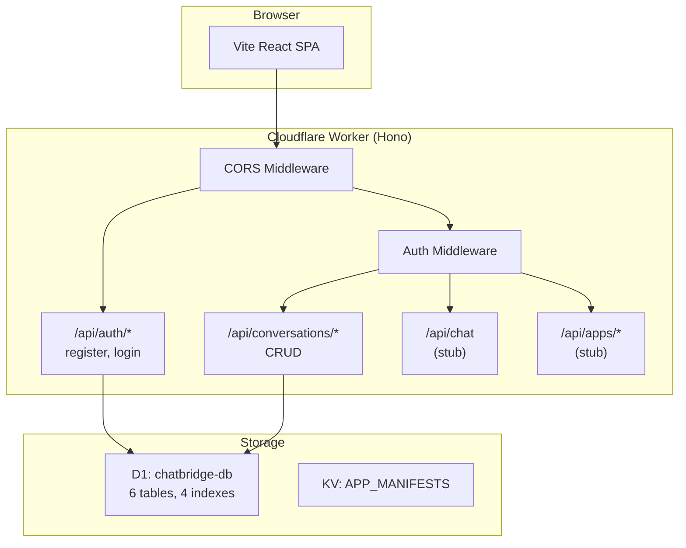

# Phase 1: Database and Auth

## Current State

Phase 0 is complete. We have:

- Vite + React 19 + Cloudflare Vite plugin scaffold in `app/`
- `wrangler.jsonc` wired for D1 (`DB`), KV (`APP_MANIFESTS`), DO (`ChatSession`)
- A bare Worker stub at `[app/src/workers/index.ts](app/src/workers/index.ts)` that returns `{"status":"ok"}` for all `/api/*`
- `.dev.vars` with `ANTHROPIC_API_KEY`, `JWT_SECRET`, `CF_AIG_TOKEN`
- Empty directories: `src/types/`, `src/lib/`, `src/hooks/`, `src/pages/`, `src/stores/`, `src/components/`, `migrations/`
- Known issue: `src/App.tsx` imports a nonexistent `hero.png` -- will fix as part of cleanup

## Step 1.1 -- D1 Migration

Create `[app/migrations/0001_initial.sql](app/migrations/0001_initial.sql)` with the exact schema from PRD section 5.1:

- **6 tables:** `users`, `apps`, `conversations`, `messages`, `app_sessions`, `app_tokens`
- **4 indexes:** `idx_messages_conversation`, `idx_app_sessions_conversation`, `idx_conversations_user`, `idx_app_tokens_user_app`
- SQLite syntax: `TEXT` for all IDs, `datetime('now')` for defaults
- Apply locally: `npx wrangler d1 migrations apply chatbridge-db --local`
- Verify: query `sqlite_master` to confirm all 6 tables exist

Schema is verbatim from the PRD (lines 254-322 of `chatbridgePRD.md`), no modifications needed.

## Step 1.2 -- TypeScript Types

Create `[app/src/types/index.ts](app/src/types/index.ts)` with interfaces for:

- `User`, `App`, `Conversation`, `Message` (with `role: 'user' | 'assistant' | 'tool_call' | 'tool_result' | 'system'`)
- `AppSession`, `AppManifest` (full manifest schema from PRD 4.1)
- `ToolResult`, `AppStateSummary`, `AppInitConfig`, `AuthResult`
- `PlatformMethods`, `AppMethods` (Penpal contract from PRD 4.2)
- `Env` type for Cloudflare bindings:

```typescript
interface Env {
  DB: D1Database;
  APP_MANIFESTS: KVNamespace;
  CHAT_SESSION: DurableObjectNamespace;
  CF_ACCOUNT_ID: string;
  AI_GATEWAY_ID: string;
  ANTHROPIC_API_KEY: string;
  JWT_SECRET: string;
  CF_AIG_TOKEN: string;
}
```

No `any` types. Export everything.

## Step 1.3 -- Worker Entry Point (Hono)

**Install:** `npm install hono`

Replace the stub in `[app/src/workers/index.ts](app/src/workers/index.ts)` with a Hono app:

- Import `Hono` from `hono`, typed with the `Env` bindings
- Set up CORS middleware (via `hono/cors`) and JSON error handling
- Define stub route groups:
  - `/api/auth/`* -- register, login (implemented in Step 1.4)
  - `/api/conversations/`* -- CRUD (implemented in Step 1.5)
  - `/api/chat` -- stub for Phase 2
  - `/api/chat/tool-result` -- stub for Phase 2
  - `/api/apps/`* -- stub for Phase 4
- Keep the `ChatSession` DO class export (empty, for wrangler binding)
- Export the Hono app as the default fetch handler

**Architecture decision:** Use Hono route groups with separate files per domain rather than a monolithic router. Structure:

```
src/workers/
  index.ts            # Hono app, mounts sub-routers, exports DO
  routes/
    auth.ts           # /api/auth/* routes
    conversations.ts  # /api/conversations/* routes
    chat.ts           # /api/chat (stub for Phase 2)
    apps.ts           # /api/apps/* (stub for Phase 4)
  middleware/
    auth.ts           # JWT verification middleware
  lib/
    crypto.ts         # PBKDF2 hashing + JWT signing/verification
```

This keeps the Worker code modular. The `src/workers/lib/` is distinct from `src/lib/` (which will hold frontend utilities).

## Step 1.4 -- Auth Routes + Middleware

### `POST /api/auth/register`

- Accepts `{ email, password, displayName }`
- Validates: email format (regex), password min 8 chars
- Hash password: PBKDF2 via Web Crypto API (SHA-256, 100k iterations, random 16-byte salt, store as `salt:hash` in hex)
- Generate user ID: `crypto.randomUUID()`
- Insert into D1 `users` table
- Return signed JWT (HS256 via Web Crypto)

### `POST /api/auth/login`

- Accepts `{ email, password }`
- Look up user by email in D1
- Verify password against stored `salt:hash`
- Return signed JWT on success, 401 on failure

### JWT Implementation (`src/workers/lib/crypto.ts`)

- `hashPassword(password)` -- PBKDF2 + random salt, returns `"salt:hash"` string
- `verifyPassword(password, stored)` -- split salt, re-derive, constant-time compare
- `signJWT(payload, secret)` -- HS256 via `crypto.subtle.sign("HMAC", ...)`, 7-day expiry
- `verifyJWT(token, secret)` -- verify signature, check expiry, return payload `{ userId, email }`
- All via Web Crypto API (available in Workers runtime natively)

### Auth Middleware (`src/workers/middleware/auth.ts`)

- Reads `Authorization: Bearer <token>` header
- Calls `verifyJWT` -- on success, sets `c.set("userId", ...)` and `c.set("email", ...)`
- Returns 401 JSON response if missing/invalid/expired
- Applied to all routes **except** `/api/auth/`*

**Decision:** Use Hono's built-in variable mechanism (`c.set`/`c.get`) for passing auth context rather than custom headers or a separate middleware pattern.

## Step 1.5 -- Conversation CRUD

All routes require auth middleware.

### `GET /api/conversations`

- Query D1: `SELECT id, title, created_at, updated_at FROM conversations WHERE user_id = ? ORDER BY updated_at DESC`
- Return array

### `POST /api/conversations`

- Accepts optional `{ title }`, defaults to `"New conversation"`
- `crypto.randomUUID()` for ID
- Insert into D1
- Return created conversation object

### `GET /api/conversations/:id`

- Verify `user_id` matches authenticated user (ownership check)
- Return conversation + all messages (`ORDER BY sequence_num`) + active app_sessions
- Single query with a join or two parallel queries

### `DELETE /api/conversations/:id`

- Verify ownership
- Delete in order: `messages` -> `app_sessions` -> `conversations` (FK constraints)
- Return `{ success: true }`

All D1 queries use parameterized bindings (`?` placeholders) to prevent SQL injection.

## Cleanup

- Fix `src/App.tsx` broken `hero.png` import (remove or replace with existing asset)

## Verification

After all steps:

1. `npm run dev` starts without errors
2. `curl http://localhost:5173/api/auth/register -X POST -H "Content-Type: application/json" -d '{"email":"test@test.com","password":"password123","displayName":"Test"}'` returns a JWT
3. Login with same credentials returns a JWT
4. Use the JWT to create, list, get, and delete conversations
5. Protected routes return 401 without a valid token

## Architecture After Phase 1




