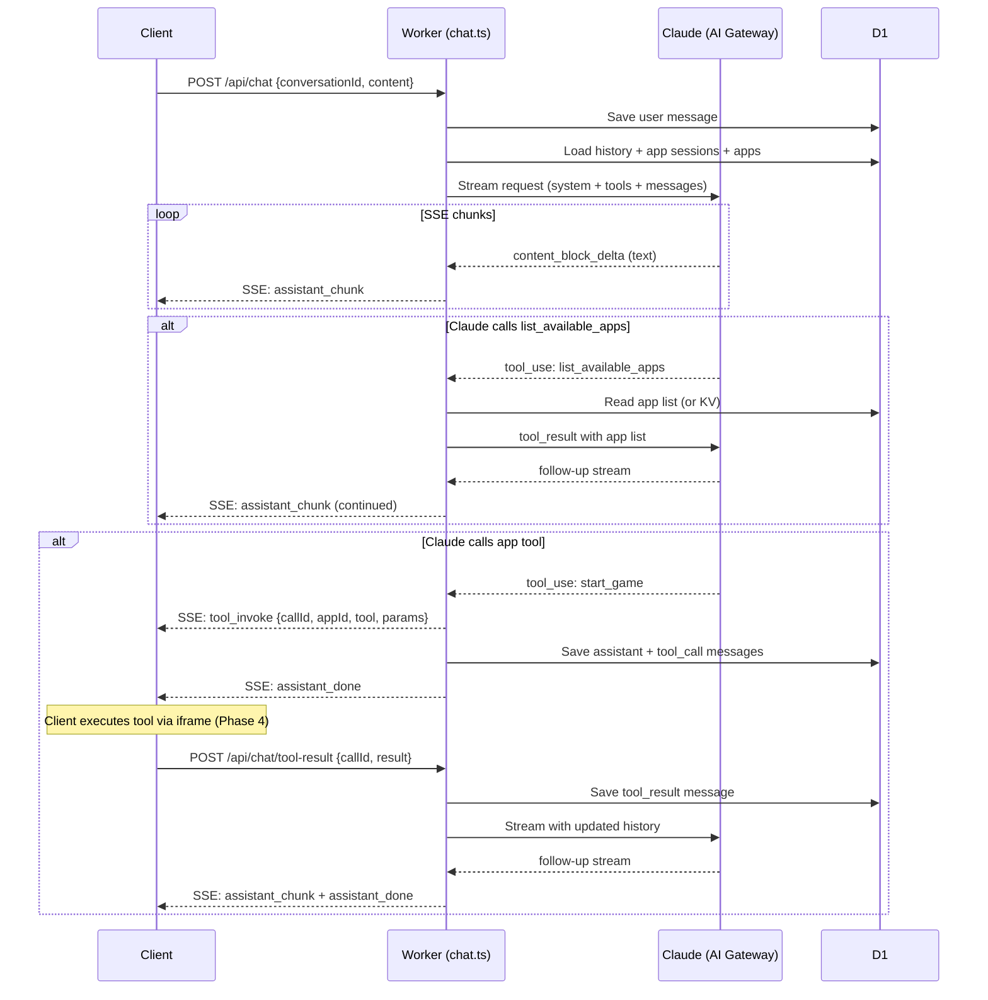

# Phase 2: Chat with Claude

## Current State

Phase 0 and Phase 1 are complete. We have:

- Hono Worker at `app/src/workers/index.ts` with CORS, auth middleware, and route mounting
- D1 schema (6 tables, 4 indexes) applied locally
- Full TypeScript types in `app/src/types/index.ts` including `Env`, `ServerMessage`, `AppManifest`, `ToolResult`
- Auth routes (register/login) + JWT middleware working
- Conversation CRUD (list, create, get with messages, delete) working
- Chat routes stubbed in `app/src/workers/routes/chat.ts` (two stubs: `POST /` and `POST /tool-result`)
- Cloudflare bindings configured: D1 (`DB`), KV (`APP_MANIFESTS`), DO (`CHAT_SESSION`)
- Env vars: `CF_ACCOUNT_ID`, `AI_GATEWAY_ID` in wrangler.jsonc; `ANTHROPIC_API_KEY`, `JWT_SECRET`, `CF_AIG_TOKEN` in `.dev.vars`

## What We're Building

Three files, one modification:

```
app/src/workers/
  claude.ts          # NEW -- AI Gateway client, system prompt builder, tool array builder
  routes/chat.ts     # MODIFY -- replace stubs with streaming SSE endpoints
  lib/sse.ts         # NEW -- SSE stream helpers (encoder, event formatter)
```

---

## Step 2.1 -- Create `app/src/workers/claude.ts`

This module encapsulates all Claude/AI Gateway communication. Three exported functions:

### `callClaude(params)`

Sends a streaming request to Claude via the AI Gateway proxy.

- **URL**: `https://gateway.ai.cloudflare.com/v1/{CF_ACCOUNT_ID}/{AI_GATEWAY_ID}/anthropic/v1/messages`
- **Headers**:
  - `x-api-key`: `ANTHROPIC_API_KEY`
  - `cf-aig-authorization`: `Bearer {CF_AIG_TOKEN}`
  - `cf-aig-metadata`: JSON with `{ userId, appId, hasToolSchemas }` for analytics tagging
  - `anthropic-version`: `2023-06-01`
  - `content-type`: `application/json`
- **Body**: `{ model: "claude-sonnet-4-20250514", max_tokens: 4096, system, tools, messages, stream: true }`
- **Returns**: the raw `Response` object (caller will consume the SSE stream)

**Key consideration**: The AI Gateway transparently proxies the Anthropic SSE format, so the response body is an SSE stream with Claude's delta events (`content_block_delta`, `content_block_start` with `tool_use` type, etc.).

### `buildSystemPrompt(activeApps, appSessions)`

Constructs the multi-section system prompt:

```
Section 1: Platform behavior (~300 tokens)
  - Role definition ("helpful AI assistant in a K-12 education platform")
  - Tool use instructions (when to call list_available_apps vs answer directly)
  - Active app preference (when a session is active, prefer that app's tools)

Section 2: Active app context (~200 tokens per active app)
  - For each active AppSession: "Chess game is active. Current state: {stateSummary}"
  - Last tool result displayText if available

Section 3: Available apps summary (always present)
  - Names + one-line descriptions from the apps list
```

**Inputs**: `activeApps: App[]` (from D1), `appSessions: AppSession[]` (from D1 query for active sessions in this conversation).

### `buildToolArray(activeAppManifests)`

Always includes `list_available_apps` as a meta-tool. When app manifests are provided (app sessions are active), converts each manifest's `tools[]` to Claude's tool format:

```typescript
{
  name: string,
  description: string,
  input_schema: { type: "object", properties: {...}, required?: [...] }
}
```

The manifest uses `parameters` (JSON Schema); Claude expects `input_schema`. This function does the rename and passes through the schema.

### `convertMessageHistory(dbMessages)`

Converts D1 message rows to Claude's `messages` array format. Key mapping:

- `role: 'user'` -> `{ role: "user", content: "..." }`
- `role: 'assistant'` -> `{ role: "assistant", content: [...] }` (text blocks; may include `tool_use` blocks reconstructed from stored `tool_name`/`tool_params`)
- `role: 'tool_call'` -> part of the preceding assistant message as a `tool_use` content block
- `role: 'tool_result'` -> `{ role: "user", content: [{ type: "tool_result", tool_use_id: "...", content: "..." }] }`

This is the trickiest part -- Claude's API expects tool_use blocks inside assistant messages and tool_result blocks inside user messages. The DB stores them as separate rows. The converter must merge consecutive tool_call rows back into the preceding assistant message.

---

## Step 2.2 -- Create `app/src/workers/lib/sse.ts`

Small utility module for constructing SSE responses:

- `formatSSEEvent(data: ServerMessage): string` -- serializes to `data: ${JSON.stringify(data)}\n\n`
- `createSSEResponse(stream: ReadableStream): Response` -- wraps a stream in the correct headers (`Content-Type: text/event-stream`, `Cache-Control: no-cache`, `Connection: keep-alive`)

---

## Step 2.3 -- Implement `POST /api/chat` in `app/src/workers/routes/chat.ts`

Replace the stub. Request body: `{ conversationId, content }`.

**Flow:**

1. **Validate** -- verify conversation exists and belongs to authenticated user (reuse pattern from conversations.ts ownership check)
2. **Get next sequence number** -- `SELECT MAX(sequence_num) FROM messages WHERE conversation_id = ?`
3. **Save user message** -- `INSERT INTO messages (id, conversation_id, role, content, sequence_num)` with `role: 'user'`
4. **Update conversation** -- `UPDATE conversations SET updated_at = datetime('now') WHERE id = ?`
5. **Load context** -- three parallel D1 queries:
  - All messages for this conversation (ordered by `sequence_num`)
  - Active app sessions for this conversation (`status = 'active'`)
  - All approved apps (for the available apps summary in system prompt)
6. **Load manifests** -- for each active app session, fetch manifest from KV (`app:{appId}`)
7. **Build Claude request** -- call `buildSystemPrompt()`, `buildToolArray()`, `convertMessageHistory()`
8. **Call Claude** -- `callClaude()` returns a streaming Response
9. **Process and forward SSE** -- use a `TransformStream` to:
  - Parse Claude's SSE events (split on `\n\n`, strip `data:`  prefix, parse JSON)
  - For `content_block_delta` with `text_delta`: forward as `{ type: "assistant_chunk", content }`
  - For `content_block_start` with `type: "tool_use"`: begin accumulating tool params
  - For `content_block_delta` with `input_json_delta`: accumulate into partial tool JSON
  - For `content_block_stop` (after a tool_use block): resolve accumulated tool, send `{ type: "tool_invoke", callId, appId, tool, params }`
  - For `message_stop`: save assistant message to D1, send `{ type: "assistant_done", messageId }`
  - On error: send `{ type: "error", message, retryable: true }`
10. **Return** the SSE response

**Claude SSE event types to handle** (from the Anthropic streaming API):

- `message_start` -- contains the message ID and model info
- `content_block_start` -- `{ type: "text" }` or `{ type: "tool_use", id, name }`
- `content_block_delta` -- `{ type: "text_delta", text }` or `{ type: "input_json_delta", partial_json }`
- `content_block_stop` -- end of a content block
- `message_delta` -- contains `stop_reason` (`end_turn`, `tool_use`, etc.)
- `message_stop` -- stream is done

**Saving the assistant message**: When the stream completes, we need to:

- Save a `role: 'assistant'` message with the full accumulated text content
- If there were tool_use blocks, also save `role: 'tool_call'` messages for each one (with `tool_name`, `tool_params` as JSON string, and `app_id`)

**Mapping tool_use to appId**: The tool name format from active manifests contains the tool name (e.g., `start_game`). We need to look up which app owns that tool by checking the loaded manifests. If the tool is `list_available_apps`, it's a platform tool -- handle it server-side (return the app list directly as a tool result and re-call Claude without involving the client).

### Handling `list_available_apps` server-side

When Claude calls `list_available_apps`:

1. Don't send `tool_invoke` to the client
2. Read the app list from KV (`app:list`)
3. Construct a tool_result message
4. Immediately call Claude again with the updated history (including the tool result)
5. Stream that second response to the client

This creates a recursive pattern -- the chat endpoint may make multiple Claude calls if `list_available_apps` is invoked. Cap at 3 iterations to prevent infinite loops.

---

## Step 2.4 -- Implement `POST /api/chat/tool-result` in `app/src/workers/routes/chat.ts`

Request body: `{ conversationId, callId, result: ToolResult }`

**Flow:**

1. **Validate** ownership of conversation
2. **Save tool_result message** -- `INSERT INTO messages` with `role: 'tool_result'`, `tool_result: JSON.stringify(result)`, link to the `callId`
3. **Load full history** (same as step 5 in `/api/chat`)
4. **Re-call Claude** with the updated history (now including the tool result)
5. **Stream response** using the same SSE processing pipeline as `/api/chat`

The SSE processing logic is shared between both endpoints. Extract it into a helper function like `streamClaudeResponse(claudeResponse, env, conversationId, nextSeqNum)`.

---

## Shared Streaming Logic -- `processClaudeStream()`

Factor the TransformStream parsing into a reusable function in `chat.ts` (or a separate file if it gets large). Both `POST /api/chat` and `POST /api/chat/tool-result` need:

1. Parse Claude SSE events
2. Forward text chunks to client
3. Detect and accumulate tool_use blocks
4. Handle `list_available_apps` server-side (recursive Claude call)
5. Save messages to D1 on stream completion
6. Return SSE response

---

## Data Flow (end-to-end for Phase 2)




---

## Error Handling (Phase 2 scope)

Keep it simple now; Phase 7 adds comprehensive error handling.

- **Claude API errors**: If `callClaude()` returns a non-2xx response, read the error body and send `{ type: "error", message: "AI service error", retryable: true }` via SSE
- **Stream parse errors**: Wrap the TransformStream in try/catch; on failure, send error event and close the stream
- **Missing conversation / unauthorized**: Return standard HTTP 404/403 JSON (not SSE) before the stream starts
- **D1 write failures**: Log and send error event

---

## Files Changed Summary


| File                             | Action         | Description                                                                                  |
| -------------------------------- | -------------- | -------------------------------------------------------------------------------------------- |
| `app/src/workers/claude.ts`      | CREATE         | AI Gateway client, system prompt builder, tool array builder, message converter              |
| `app/src/workers/lib/sse.ts`     | CREATE         | SSE formatting and response helpers                                                          |
| `app/src/workers/routes/chat.ts` | MODIFY         | Replace stubs with streaming chat and tool-result endpoints                                  |
| `app/src/types/index.ts`         | MODIFY (minor) | Add Claude API types if needed (e.g., `ClaudeMessage`, `ClaudeTool`) -- optional, can inline |


---

## Verification

After implementation:

```bash
# 1. Register + get JWT
TOKEN=$(curl -s -X POST http://localhost:5173/api/auth/register \
  -H "Content-Type: application/json" \
  -d '{"email":"test2@test.com","password":"password123","displayName":"Test"}' | jq -r '.token')

# 2. Create conversation
CONV_ID=$(curl -s -X POST http://localhost:5173/api/conversations \
  -H "Authorization: Bearer $TOKEN" \
  -H "Content-Type: application/json" \
  -d '{"title":"Test chat"}' | jq -r '.id')

# 3. Send a chat message (should stream SSE back)
curl -N -X POST http://localhost:5173/api/chat \
  -H "Authorization: Bearer $TOKEN" \
  -H "Content-Type: application/json" \
  -d "{\"conversationId\":\"$CONV_ID\",\"content\":\"Hello, what can you do?\"}"
```

Expected output: SSE events streaming back with `assistant_chunk` events followed by `assistant_done`. No tool invocations yet (no apps registered).

---

## Gotchas and Decisions

- **Claude SSE format**: Claude's streaming events use `event: <type>\ndata: <json>\n\n` format. The `event:` line contains the event type (`content_block_delta`, etc.) and `data:` contains the JSON payload. Parse both.
- **Partial JSON in tool params**: Claude streams tool input as `input_json_delta` fragments. You must accumulate these string fragments and `JSON.parse()` the final concatenated string when `content_block_stop` fires.
- **list_available_apps server-side handling**: This is handled entirely on the Worker -- no SSE event sent to client. The Worker constructs a synthetic tool_result and re-calls Claude. This means the streaming response to the client may actually involve 2+ Claude API calls stitched together.
- **Sequence numbers**: Each message row gets an incrementing `sequence_num`. The user message, assistant message, and any tool_call/tool_result messages all get sequential numbers. Use `MAX(sequence_num) + 1` at the start and increment locally.
- **D1 writes at stream end**: The assistant message content isn't known until the stream finishes. Buffer the full text during streaming, then write to D1 in the `message_stop` handler.

