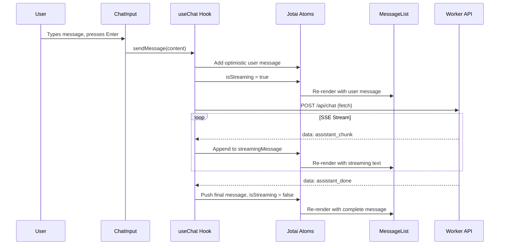

# Phase 3: Frontend -- Chat UI

## Current State

Phases 0-2 are complete. The backend is fully functional:

- Hono Worker with auth, conversation CRUD, and streaming chat endpoints
- Claude integration via AI Gateway with SSE streaming
- D1 schema applied, types defined in `[app/src/types/index.ts](app/src/types/index.ts)`
- **The frontend is still the stock Vite template** -- `[app/src/App.tsx](app/src/App.tsx)` is a counter demo, `[app/src/main.tsx](app/src/main.tsx)` is vanilla React bootstrap
- No frontend dependencies beyond `react` and `react-dom` (see `[app/package.json](app/package.json)`)
- The `src/components/`, `src/hooks/`, `src/stores/`, `src/pages/`, `src/lib/` directories **do not exist** despite being planned in Phase 0

## What We're Building

```
app/src/
  lib/
    api.ts                  # Fetch wrapper with JWT auth
  stores/
    auth.ts                 # JWT token atom, user derived atom
    conversations.ts        # Conversation list + active conversation atoms
    apps.ts                 # Available apps + active app sessions atoms
    chat.ts                 # Messages atom, streaming state atom, pending tool calls
  hooks/
    useChat.ts              # SSE streaming hook (sendMessage, submitToolResult)
  pages/
    LoginPage.tsx           # Email/password login form
    RegisterPage.tsx        # Registration form
    ChatPage.tsx            # Main 3-panel layout
  components/
    chat/
      ConversationList.tsx  # Sidebar conversation list
      MessageList.tsx       # Scrollable message display
      ChatInput.tsx         # Text input + send button
    auth/
      AuthGuard.tsx         # Redirect wrapper for protected routes
    ui/
      LoadingSpinner.tsx    # Shared loading indicator
  index.css                 # Replace with Tailwind v4 import
  main.tsx                  # Update with Router + Jotai Provider
  App.tsx                   # Delete/replace -- no longer needed
  routes.ts                 # TanStack Router route tree
```

---

## Step 3.1 -- Install Dependencies and Configure Tailwind v4

**Install:**

```bash
cd app
npm install jotai @tanstack/react-router penpal
npm install -D tailwindcss @tailwindcss/vite
```

**Configure Tailwind v4 in `[app/vite.config.ts](app/vite.config.ts)`:**

```typescript
import { defineConfig } from "vite";
import react from "@vitejs/plugin-react";
import { cloudflare } from "@cloudflare/vite-plugin";
import tailwindcss from "@tailwindcss/vite";

export default defineConfig({
  plugins: [react(), tailwindcss(), cloudflare()],
});
```

**Replace `[app/src/index.css](app/src/index.css)`** with Tailwind v4 import + dark theme base:

```css
@import "tailwindcss";
```

Tailwind v4 uses CSS-first configuration (no `tailwind.config.js`). Custom theme tokens go into `index.css` via `@theme` if needed later. Delete `[app/src/App.css](app/src/App.css)` (no longer used).

---

## Step 3.2 -- API Client (`src/lib/api.ts`)

A thin fetch wrapper that:

- Reads the JWT from the Jotai `authTokenAtom` (passed in or read from localStorage)
- Prepends the base URL (empty string for same-origin in dev/prod)
- Attaches `Authorization: Bearer <token>` header
- Returns typed JSON or raw Response for SSE endpoints
- Throws on non-2xx (except SSE endpoints which return the raw Response)

This is a dependency for stores and hooks. Key functions:

- `apiFetch<T>(path, options)` -- JSON fetch with auth
- `apiStream(path, options)` -- raw Response for SSE consumption

---

## Step 3.3 -- Jotai Stores

### `src/stores/auth.ts`

- `authTokenAtom` -- `atomWithStorage<string | null>("chatbridge_token", null)` (persists to localStorage)
- `userAtom` -- derived atom that decodes the JWT payload (base64 decode of the middle segment) to extract `{ userId, email }`
- `isAuthenticatedAtom` -- derived boolean: token exists and not expired

### `src/stores/conversations.ts`

- `conversationsAtom` -- `atom<Conversation[]>([])` (populated by fetch)
- `activeConversationIdAtom` -- `atom<string | null>(null)`
- `activeConversationAtom` -- derived: finds the matching conversation from the list

### `src/stores/chat.ts`

- `messagesAtom` -- `atom<Message[]>([])` for the active conversation
- `isStreamingAtom` -- `atom<boolean>(false)` (disables input during streaming)
- `pendingToolCallAtom` -- `atom<ServerMessage | null>(null)` (consumed by app bridge in Phase 4)
- `streamingMessageAtom` -- `atom<string>("")` (accumulates chunks during streaming)

### `src/stores/apps.ts`

- `availableAppsAtom` -- `atom<App[]>([])` (loaded from `GET /api/apps`)
- `activeAppSessionsAtom` -- `atom<AppSession[]>([])` (for current conversation)

All atoms are simple `atom()` -- we'll use imperative `useSetAtom`/`useAtomValue` in hooks to update them after API calls rather than Jotai async atoms. This avoids complexity with the SSE streaming pattern.

---

## Step 3.4 -- Auth Pages

### `src/pages/LoginPage.tsx`

- Centered card with email + password inputs
- Submit calls `POST /api/auth/login`
- On success: sets `authTokenAtom`, navigates to `/chat`
- Shows error toast on 401 (invalid credentials)
- Link to `/register`
- Dark theme (Tailwind: `bg-gray-900`, `text-gray-100`)

### `src/pages/RegisterPage.tsx`

- Same layout + display name field
- Submit calls `POST /api/auth/register`
- Client-side validation: email format, password >= 8 chars
- On success: sets `authTokenAtom`, navigates to `/chat`
- Link to `/login`

Both pages share the same centered layout shell. No separate `AuthGuard` component needed -- the router handles redirects.

---

## Step 3.5 -- Chat Layout (`src/pages/ChatPage.tsx`)

Three-panel layout (matches build guide section 3.4):

```
+------------------+----------------------------+------------------+
|  Sidebar (250px) |   Chat Panel (flex-1)      | App Panel (350px)|
|                  |                            |  (conditional)   |
| ConversationList |  MessageList               |                  |
| [New Chat]       |  ...messages...            |  (Phase 4)       |
|                  |                            |                  |
| User info        |  ChatInput                 |                  |
+------------------+----------------------------+------------------+
```

### `src/components/chat/ConversationList.tsx`

- Fetches conversations on mount via `GET /api/conversations`
- Updates `conversationsAtom`
- "New Chat" button calls `POST /api/conversations`, adds to list, selects it
- Click selects conversation (sets `activeConversationIdAtom`), loads messages via `GET /api/conversations/:id`
- Active conversation highlighted with accent background
- Delete button per conversation
- User email + logout button at bottom

### `src/components/chat/MessageList.tsx`

- Reads `messagesAtom` + `streamingMessageAtom`
- User messages: right-aligned, accent-colored bubble
- Assistant messages: left-aligned, darker bubble
- `tool_call` messages: subtle system indicator ("Using Chess...")
- `tool_result` messages: hidden (Claude's follow-up is what the user sees)
- Auto-scroll to bottom via `useEffect` + `scrollIntoView`
- Shows streaming message as it accumulates (blinking cursor)
- Empty state: "Start a conversation" prompt

### `src/components/chat/ChatInput.tsx`

- `textarea` with auto-resize (min 1 line, max ~5 lines)
- Send button (arrow icon) -- disabled when `isStreamingAtom` is true or input is empty
- Enter to send, Shift+Enter for newline
- Calls `sendMessage()` from `useChat` hook

---

## Step 3.6 -- SSE Streaming Hook (`src/hooks/useChat.ts`)

This is the most critical piece -- it bridges the frontend to the streaming backend.

### `sendMessage(content: string)`

1. Add user message to `messagesAtom` optimistically (generate temp ID)
2. Set `isStreamingAtom = true`, `streamingMessageAtom = ""`
3. `POST /api/chat` with `{ conversationId, content }` via `fetch()` (not EventSource -- need POST + auth header)
4. Read the response body as a `ReadableStream`:
  - Use `getReader()` + `TextDecoder` to read chunks
  - Buffer and split on `\n\n` to extract SSE events
  - Each event is `data: <json>\n\n` -- strip `data:`  prefix, parse JSON
5. Dispatch based on `type` field:
  - `"assistant_chunk"`: append `content` to `streamingMessageAtom`
  - `"tool_invoke"`: set `pendingToolCallAtom` (Phase 4 will consume this)
  - `"assistant_done"`: finalize -- push completed message to `messagesAtom`, clear `streamingMessageAtom`, set `isStreamingAtom = false`
  - `"error"`: show error, set `isStreamingAtom = false`

### `submitToolResult(callId: string, result: ToolResult)`

Same pattern as `sendMessage` but calls `POST /api/chat/tool-result` with `{ conversationId, callId, result }`. Streams the follow-up response identically.

### SSE Parsing

The backend emits `data: {...}\n\n` format (no `event:` prefix -- see `[app/src/workers/lib/sse.ts](app/src/workers/lib/sse.ts)` line 3-5). The parser:

```typescript
let buffer = "";
while (true) {
  const { done, value } = await reader.read();
  if (done) break;
  buffer += decoder.decode(value, { stream: true });
  const parts = buffer.split("\n\n");
  buffer = parts.pop() ?? "";
  for (const part of parts) {
    const line = part.trim();
    if (!line.startsWith("data: ")) continue;
    const json = JSON.parse(line.slice(6));
    // dispatch based on json.type
  }
}
```

---

## Step 3.7 -- TanStack Router Setup

### `src/routes.ts`

Route tree:

- `/` -- redirect to `/chat` if authenticated, `/login` if not
- `/login` -- `LoginPage` (redirect to `/chat` if already authenticated)
- `/register` -- `RegisterPage` (redirect to `/chat` if already authenticated)
- `/chat` -- `ChatPage` (redirect to `/login` if not authenticated)

### Update `src/main.tsx`

- Wrap app in `<Provider>` (Jotai) + `<RouterProvider>` (TanStack Router)
- Remove import of old `App.tsx`

### Delete/replace files

- Delete `src/App.tsx` (replaced by router)
- Delete `src/App.css` (Tailwind handles all styles)
- Keep `src/assets/` for now (logos can be removed later)

---

## Data Flow




---

## Key Decisions

- **Tailwind v4** -- CSS-first config, no `tailwind.config.js`. Import via `@import "tailwindcss"` in `index.css`. Uses the `@tailwindcss/vite` plugin in `vite.config.ts`.
- **Jotai over Zustand** -- matches the build guide spec. Simple atoms + derived atoms. No async atoms for SSE (imperative updates from the hook are cleaner).
- **fetch() over EventSource** for SSE -- EventSource only supports GET. We need POST with JSON body + auth headers.
- **No react-markdown yet** -- basic text rendering for now. Markdown support comes in Phase 9 (polish).
- **Dark theme first** -- matches the build guide ("Dark theme preferred"). Tailwind `dark:` variant based on `prefers-color-scheme` or explicit class.
- **Right panel placeholder** -- render the conditional app panel container but leave it empty. Phase 4 fills it with `AppContainer.tsx`.

## Files Changed Summary


| File                                           | Action  | Description                                                               |
| ---------------------------------------------- | ------- | ------------------------------------------------------------------------- |
| `app/package.json`                             | MODIFY  | Add jotai, @tanstack/react-router, penpal, tailwindcss, @tailwindcss/vite |
| `app/vite.config.ts`                           | MODIFY  | Add tailwindcss plugin                                                    |
| `app/src/index.css`                            | REPLACE | Tailwind v4 import + base dark theme styles                               |
| `app/src/App.css`                              | DELETE  | No longer needed                                                          |
| `app/src/App.tsx`                              | DELETE  | Replaced by router                                                        |
| `app/src/main.tsx`                             | REPLACE | Jotai Provider + TanStack RouterProvider                                  |
| `app/src/lib/api.ts`                           | CREATE  | Fetch wrapper with JWT auth                                               |
| `app/src/stores/auth.ts`                       | CREATE  | Auth token + user atoms                                                   |
| `app/src/stores/conversations.ts`              | CREATE  | Conversation list + active conversation atoms                             |
| `app/src/stores/chat.ts`                       | CREATE  | Messages + streaming state atoms                                          |
| `app/src/stores/apps.ts`                       | CREATE  | Available apps + active sessions atoms                                    |
| `app/src/hooks/useChat.ts`                     | CREATE  | SSE streaming hook                                                        |
| `app/src/pages/LoginPage.tsx`                  | CREATE  | Login form                                                                |
| `app/src/pages/RegisterPage.tsx`               | CREATE  | Registration form                                                         |
| `app/src/pages/ChatPage.tsx`                   | CREATE  | Main 3-panel chat layout                                                  |
| `app/src/components/chat/ConversationList.tsx` | CREATE  | Sidebar conversation list                                                 |
| `app/src/components/chat/MessageList.tsx`      | CREATE  | Message display with streaming                                            |
| `app/src/components/chat/ChatInput.tsx`        | CREATE  | Chat input with send button                                               |
| `app/src/routes.ts`                            | CREATE  | TanStack Router route tree                                                |


