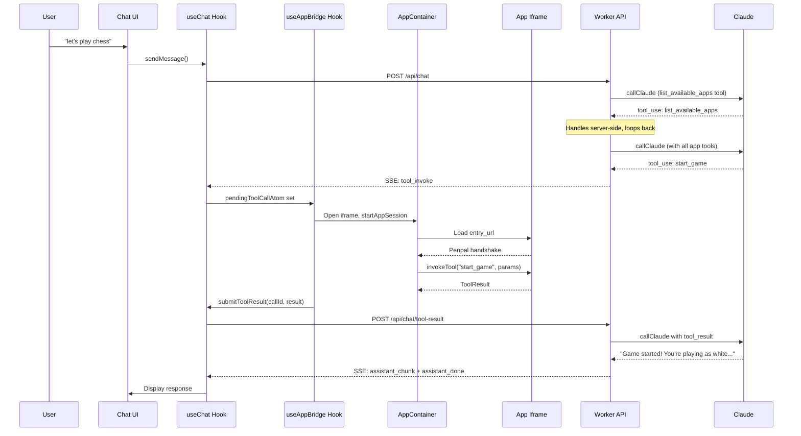

# Phase 4: Plugin System -- The Core Challenge

## Current State

Phases 0-3 are complete. The backend has auth, conversations, streaming chat with Claude via AI Gateway, and the `list_available_apps` server-side loop (already handles discovery + manifest injection in `[app/src/workers/routes/chat.ts](app/src/workers/routes/chat.ts)` lines 413-477). The frontend has auth pages, a 3-panel layout (right panel is a placeholder comment), Jotai stores, and SSE streaming with `pendingToolCallAtom` already wired in `[app/src/hooks/useChat.ts](app/src/hooks/useChat.ts)`.

**Already done (from earlier phases):**

- `buildToolArray()` with `list_available_apps` always included (`[app/src/workers/claude.ts](app/src/workers/claude.ts)` lines 141-177)
- `buildToolToAppMap()` for reverse tool-name-to-appId lookup
- SSE `tool_invoke` events sent to client for app tool calls (`[app/src/workers/routes/chat.ts](app/src/workers/routes/chat.ts)` lines 480-498)
- `pendingToolCallAtom` set by `useChat` on `tool_invoke` events (`[app/src/hooks/useChat.ts](app/src/hooks/useChat.ts)` line 112)
- `availableAppsAtom` and `activeAppSessionsAtom` declared in `[app/src/stores/apps.ts](app/src/stores/apps.ts)`
- All TypeScript types for manifests, Penpal interfaces, tool results in `[app/src/types/index.ts](app/src/types/index.ts)`

**Still stub / missing:**

- `routes/apps.ts` -- all three endpoints return "Phase 4" stubs
- No `src/components/apps/` directory or files
- No `useAppBridge.ts` or `useAppSession.ts` hooks
- No app session API endpoints (`POST /api/app-sessions`, `PATCH /api/app-sessions/:id`)
- Right panel in `ChatPage.tsx` is a comment
- No spike test app

---

## Architecture




---

## Step 4.1 -- Implement App Registration API

Replace stubs in `[app/src/workers/routes/apps.ts](app/src/workers/routes/apps.ts)`.

`**POST /api/apps/register**`

- Accept JSON body matching `AppManifest`
- Validate required fields: `id`, `name`, `entry_url`, `tools` (non-empty array), `version`, `description`, `author`, `category`, `auth`, `iframe`, `completion_events`
- Validate each tool has `name`, `description`, `parameters` with `type: "object"`
- Store manifest in KV: `app:{appId}` -> full manifest JSON
- Upsert into D1 `apps` table: id, name, slug (derived from id), manifest_json, status='approved', entry_url, auth_type
- Rebuild `app:list` KV key: read all approved apps from D1, write summary array to KV
- Return the created app record

`**GET /api/apps**`

- Try KV `app:list` first for fast reads
- Fallback: query D1 for all approved apps
- Return array of `{ id, name, description, category, authType, entryUrl }`

`**GET /api/apps/:id/manifest**`

- Read from KV `app:{id}`
- Return full manifest or 404

---

## Step 4.2 -- App Session API Endpoints

Add new routes to handle app session lifecycle. These can go in a new file `app/src/workers/routes/app-sessions.ts` or be added to `routes/apps.ts`.

`**POST /api/app-sessions**`

- Body: `{ conversationId, appId }`
- Verify conversation ownership
- Insert into D1 `app_sessions` with status='active'
- Return the session record

`**PATCH /api/app-sessions/:id**`

- Body: `{ status?, stateSummary?, stateRaw?, completedAt? }`
- Verify ownership (join through conversation)
- Update the session in D1
- Return updated record

Mount these in `[app/src/workers/index.ts](app/src/workers/index.ts)` under `/api/app-sessions` with auth middleware.

---

## Step 4.3 -- Build AppContainer Component

Create `app/src/components/apps/AppContainer.tsx`.

- Props: `manifest: AppManifest`, `sessionId: string`, `onClose: () => void`, `onToolResult: (callId: string, result: ToolResult) => void`, plus expose `invokeTool` via ref or callback registration
- Render a sandboxed iframe with attributes from PRD section 4.5:
  - `sandbox="allow-scripts allow-forms allow-popups allow-popups-to-escape-sandbox"`
  - `allow="clipboard-write"`
  - `referrerpolicy="no-referrer"`
  - `src={manifest.entry_url}`
  - Dimensions from `manifest.iframe.width` / `manifest.iframe.height`
- Use Penpal `connectToChild()` with 5s timeout to establish connection
- Expose `PlatformMethods` to the app:
  - `notifyStateUpdate(state)` -- update `activeAppSessionsAtom`, PATCH session via API
  - `signalCompletion(event, summary)` -- call `onClose` handler, PATCH session status='completed'
  - `requestResize(height)` -- adjust iframe height
  - `requestAuth(provider, scopes)` -- stub for now (Phase 6 implements OAuth)
- Store `appMethods` (from Penpal connection) in a ref, call `initialize()` on connect
- States: loading (spinner), connected (show iframe), error (retry button), disconnected
- Header bar with app name + close/minimize button

---

## Step 4.4 -- Build useAppBridge Hook

Create `app/src/hooks/useAppBridge.ts`.

This is the orchestration layer between `pendingToolCallAtom` (set by SSE) and the AppContainer.

- Watch `pendingToolCallAtom` via `useAtomValue`
- When a `tool_invoke` event arrives:
  - If `tool.name === "list_available_apps"` -- should never reach here (handled server-side), but guard anyway
  - Look up the manifest from `availableAppsAtom` by `appId`
  - If no app session exists for this app, call `POST /api/app-sessions` to create one
  - Set state to render AppContainer with the manifest (update a `activeAppAtom` or similar)
  - Once AppContainer is connected (Penpal ready), call `appMethods.invokeTool(toolName, params)`
  - On result: call `submitToolResult(callId, result)` from `useChat`
  - On error/timeout (10s): return error ToolResult to Claude
- Clear `pendingToolCallAtom` after handling

Key challenge: the hook needs to coordinate async flow between "iframe loads + Penpal connects" and "invoke tool". Use a promise-based pattern -- store a `readyPromise` that resolves when AppContainer's Penpal connection completes, await it before invoking.

---

## Step 4.5 -- Build useAppSession Hook

Create `app/src/hooks/useAppSession.ts`.

- `startAppSession(appId, conversationId)` -- POST to `/api/app-sessions`, update `activeAppSessionsAtom`
- `endAppSession(sessionId, event?, summary?)` -- PATCH session to completed, update atom, optionally hide iframe
- `updateSessionState(sessionId, state)` -- PATCH session with state_summary/state_raw
- Fetch active sessions for a conversation when `activeConversationIdAtom` changes

---

## Step 4.6 -- Wire Right Panel in ChatPage

Update `[app/src/pages/ChatPage.tsx](app/src/pages/ChatPage.tsx)` to:

- Import and render AppContainer conditionally when an app is active
- The right panel (350px, conditional) shows the iframe
- Integrate `useAppBridge` at this level to coordinate tool invocations
- Show/hide based on active app session state

The layout change:

```
{activeApp && (
  <div className="w-[350px] border-l border-gray-800">
    <AppContainer
      manifest={activeApp.manifest}
      sessionId={activeApp.sessionId}
      ...
    />
  </div>
)}
```

---

## Step 4.7 -- Spike Test: Penpal + Sandbox

Create `app/public/test-app.html` -- a standalone HTML file that:

- Loads Penpal from CDN (`https://unpkg.com/penpal/dist/penpal.min.js`)
- Calls `Penpal.connectToParent()` exposing `AppMethods`: `initialize`, `invokeTool`, `getState`, `destroy`
- `invokeTool` returns `{ success: true, displayText: "Test tool: " + name }`
- After connecting, calls `parent.notifyStateUpdate()`

Create and register a test manifest:

- `id: "test-app"`, `entry_url: "/test-app.html"` (served by Vite static)
- One dummy tool: `{ name: "test_action", description: "A test action", parameters: { type: "object", properties: {} } }`

Register via curl, then test in chat: "use the test app" -- Claude should discover via `list_available_apps`, invoke `test_action`, iframe loads, Penpal connects, result returns to Claude.

This validates the entire 11-step tool invocation lifecycle before building real apps.

---

## New/Modified Files Summary


| File                                       | Action  | Purpose                                         |
| ------------------------------------------ | ------- | ----------------------------------------------- |
| `app/src/workers/routes/apps.ts`           | REPLACE | Real app registration, list, manifest endpoints |
| `app/src/workers/routes/app-sessions.ts`   | CREATE  | App session CRUD endpoints                      |
| `app/src/workers/index.ts`                 | MODIFY  | Mount `/api/app-sessions` route                 |
| `app/src/components/apps/AppContainer.tsx` | CREATE  | Sandboxed iframe + Penpal bridge                |
| `app/src/hooks/useAppBridge.ts`            | CREATE  | Tool invocation orchestration                   |
| `app/src/hooks/useAppSession.ts`           | CREATE  | App session lifecycle                           |
| `app/src/stores/apps.ts`                   | MODIFY  | Add activeAppAtom, connection state             |
| `app/src/pages/ChatPage.tsx`               | MODIFY  | Wire right panel with AppContainer              |
| `app/public/test-app.html`                 | CREATE  | Penpal spike test app                           |


---

## Key Risks and Mitigations

- **Penpal + `sandbox` without `allow-same-origin`**: This is the primary risk. Penpal uses `postMessage` under the hood, so it should work, but the spike test (Step 4.7) validates this before building real apps. Fallback: raw `postMessage` wrapper with typed methods.
- **Async coordination (iframe load -> Penpal connect -> invokeTool)**: The tool_invoke SSE event fires before the iframe exists. Need a promise queue pattern -- buffer the invocation, create the iframe, wait for Penpal handshake, then invoke. Race condition window ~2-5s.
- **Multiple tool calls in one response**: Claude might call multiple tools at once. The current `pendingToolCallAtom` holds a single value. May need to change to an array/queue if this becomes an issue. For MVP, handle one at a time sequentially.

