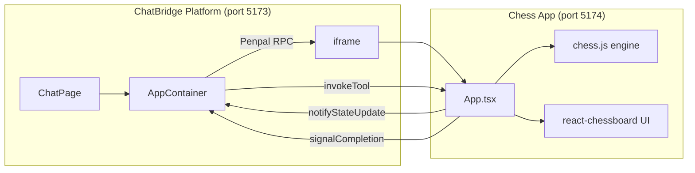

# Phase 5: Chess App (3-4 hours)

## Context

Phases 0-4 are complete. The platform has:

- Working chat with Claude streaming via SSE (`[app/src/workers/routes/chat.ts](app/src/workers/routes/chat.ts)`)
- Full plugin infra: `AppContainer` (Penpal iframe bridge), `useAppBridge` (tool dispatch), `useAppSession` (lifecycle), app registration API, KV manifest storage
- A passing spike test (`test-app.html` + `test-app-manifest.json`)
- No `apps/` directory exists yet at the repo root

The chess app will be the **first real third-party app**, proving the entire architecture works with stateful, bidirectional interactions.

---

## Step 5.1 -- Scaffold the chess project

Create `apps/chess/` as a standalone Vite + React + TypeScript project, completely separate from the `app/` platform.

```bash
mkdir -p apps && cd apps
npm create vite@latest chess -- --template react-ts
cd chess
npm install chess.js react-chessboard penpal
npm install -D tailwindcss @tailwindcss/vite
```

- Configure `vite.config.ts` with React + Tailwind plugins
- Set dev server port to `5174` to avoid collision with the platform on `5173`
- Add `@import "tailwindcss"` to `src/index.css`
- Clean out default Vite boilerplate (`App.css`, logos, counter code)

**No Cloudflare plugin needed** -- this is a pure static SPA that will deploy to CF Pages later.

---

## Step 5.2 -- Build the chess app

### Architecture




### File: `apps/chess/src/App.tsx`

Single-component app that:

1. **On mount** -- connects to parent via Penpal (`connect` + `WindowMessenger` targeting `window.parent`, same pattern as `[app/public/test-app.html](app/public/test-app.html)`)
2. **Exposes `AppMethods`** to the platform:
  - `initialize(config)` -- store sessionId/theme, prepare UI
  - `invokeTool(toolName, params)` -- dispatch to handler functions:
    - `start_game({ player_color?, difficulty? })` -- create new `Chess()` instance, set colors, return starting board state + displayText
    - `make_move({ move })` -- validate via `chess.move()`, apply AI counter-move (random legal move for MVP), return result + displayText
    - `get_board_state()` -- return FEN, move history, game status, legal moves list + displayText
    - `analyze_position()` -- return legal moves with simple heuristic evaluation + displayText
  - `getState()` -- return `{ raw: { fen, history, playerColor, ... }, display: "human-readable summary" }`
  - `destroy()` -- cleanup
3. **Renders `<Chessboard />`** from `react-chessboard`:
  - Position from `chess.fen()`
  - `onPieceDrop` validates move via `chess.move()`, then calls `parent.notifyStateUpdate()`
  - After each player move, auto-play AI counter-move (random legal move)
  - Board orientation based on `playerColor` state
  - On game over (checkmate/stalemate/draw), call `parent.signalCompletion()`
4. **Every `ToolResult`** includes descriptive `displayText` so Claude can narrate the game. Examples from the build guide:
  - `start_game`: "New chess game started. You are playing as white. Board is in starting position."
  - `make_move`: "Move e4 played. White pawn moved to e4. Black to move."
  - `get_board_state`: "Position after 12 moves. White has slight material advantage..."
  - `analyze_position`: "Position evaluation: roughly equal. Suggested moves: 1) Nf3..."

### AI opponent logic (MVP)

Random legal move selection. No minimax or Stockfish needed -- Claude provides the "smart" analysis via `analyze_position`. The random opponent is just so the user has someone to play against. Can upgrade to better AI later.

### Styling

- Dark theme (`bg-gray-900`, `text-gray-200`) matching platform aesthetic
- Board centered, responsive within the 350px side panel width
- Tailwind utility classes, no custom CSS file needed beyond the Tailwind import

---

## Step 5.3 -- Create and register the chess manifest

Create `apps/chess/manifest.json` with the full manifest matching the PRD spec. Key values:

- `id`: `"chess"`
- `entry_url`: `"http://localhost:5174"` for local dev (updated to `*.pages.dev` on deploy in Phase 10)
- 4 tools: `start_game`, `make_move`, `get_board_state`, `analyze_position` -- with full JSON Schema `parameters` blocks
- `completion_events`: `["game_over", "user_resigned", "draw_agreed"]`

Registration via curl:

```bash
curl -X POST http://localhost:5173/api/apps/register \
  -H "Authorization: Bearer $TOKEN" \
  -H "Content-Type: application/json" \
  -d @apps/chess/manifest.json
```

This hits `[app/src/workers/routes/apps.ts](app/src/workers/routes/apps.ts)` `POST /register` which stores in KV (`app:chess`) and D1, rebuilds `app:list`.

---

## Step 5.4 -- Test the full lifecycle

Run both dev servers:

```bash
# Terminal 1: Platform
cd app && npm run dev

# Terminal 2: Chess app
cd apps/chess && npm run dev -- --port 5174
```

### Test sequence

1. "Let's play chess" -- Claude calls `list_available_apps` (handled server-side in `[chat.ts](app/src/workers/routes/chat.ts)`), discovers chess, then calls `start_game`
2. SSE sends `tool_invoke` -- `useAppBridge` fetches manifest, creates session, sets `activeAppAtom`, `AppContainer` renders iframe pointing to `localhost:5174`
3. Penpal handshake completes -- `appContainerReadyAtom` fires, queued `invokeTool("start_game", ...)` executes
4. Chess board appears in 350px right panel
5. Make moves on the board -- `notifyStateUpdate` syncs state to platform
6. "What should I do?" -- Claude calls `get_board_state` or `analyze_position`, reads displayText, gives advice
7. Play to checkmate -- app calls `signalCompletion("game_over", "Checkmate! White wins.")`
8. `useAppSession.endAppSession()` patches D1, iframe closes
9. "How did that game go?" -- Claude sees the stored completion summary in context

### Key things to verify

- Penpal connection works with sandboxed iframe (cross-origin, `allow-scripts` only)
- Tool invocation round-trips correctly through the 4-hop chain
- Board renders correctly within 350px panel
- State persistence: completion summary available in subsequent messages
- Error cases: invalid move handling, connection timeout recovery

---

## Cross-origin consideration

Since the chess app runs on `localhost:5174` and the platform on `localhost:5173`, these are different origins. The iframe sandbox does NOT include `allow-same-origin`. Penpal uses `postMessage` with `allowedOrigins: ["*"]` (already configured in both the platform's `AppContainer` and the test app). This should work -- the spike test already proved this pattern.

---

## Dependencies summary


| Package                             | Purpose                          | Install location       |
| ----------------------------------- | -------------------------------- | ---------------------- |
| `chess.js`                          | Game logic, move validation, FEN | `apps/chess/`          |
| `react-chessboard`                  | Board UI component               | `apps/chess/`          |
| `penpal`                            | Iframe RPC bridge                | `apps/chess/`          |
| `tailwindcss` + `@tailwindcss/vite` | Styling                          | `apps/chess/` (devDep) |


No changes needed to the platform's `app/` code -- the plugin infrastructure from Phase 4 handles everything.