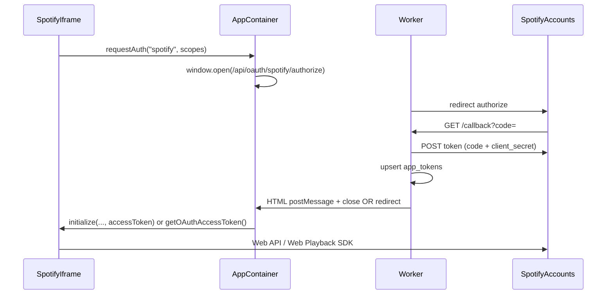

# Phase 6: Weather + Spotify (revised from guide)

## Context from the repo

- **Reference app:** [apps/chess/src/App.tsx](apps/chess/src/App.tsx) — Penpal `WindowMessenger`, `initialize` / `invokeTool` / `getState` / `destroy`, `PlatformMethods` shape.
- **Manifest pattern:** [apps/chess/manifest.json](apps/chess/manifest.json) — `auth.type`, `tools[]`, `entry_url`, `iframe.sandbox`.
- **OAuth gap:** [app/src/components/apps/AppContainer.tsx](app/src/components/apps/AppContainer.tsx) `requestAuth` is a stub (`OAuth not yet implemented`). Phase 6 must implement the parent-side popup flow and Worker routes; [app/migrations/0001_initial.sql](app/migrations/0001_initial.sql) already defines `app_tokens` (encrypted blobs + refresh + expiry).
- **Types:** [app/src/types/index.ts](app/src/types/index.ts) — `AppInitConfig` today has no OAuth fields; `PlatformMethods.requestAuth(provider, scopes)` exists but needs a real implementation and likely a **token refresh** path for long sessions.

## Architecture (OAuth + Penpal)

Use a **confidential Authorization Code** flow on the Worker (client id + **client secret** in `wrangler secret`) — appropriate for server-side token exchange. Register redirect URIs in the [Spotify Developer Dashboard](https://developer.spotify.com/dashboard) (e.g. `http://localhost:5173/api/oauth/spotify/callback` and production equivalent).

**CSRF:** `state` query param bound to logged-in user (signed or random id stored in short-lived cookie/KV).

---

## Part A — App 2: Weather dashboard (`apps/weather`)

Follow [chatbridgebuildguide.md](.cursor/plans/chatbridgebuildguide.md) Step 6.1 (lines ~902–937) with these concrete deliverables:

1. **Scaffold:** `npm create vite@latest weather -- --template react-ts`, `penpal`, align Vite port with manifest (e.g. `5175` to avoid clashing with chess `5174`).
2. **Tools (invokeTool):**
   - `get_weather` — `{ location }` → Open-Meteo geocode then forecast ([geocoding API](https://geocoding-api.open-meteo.com/v1/search), [forecast API](https://api.open-meteo.com/v1/forecast)).
   - `get_forecast` — `{ location, days }` — multi-day slice.
3. **UI:** Card with current temp, condition, wind, humidity, 3-day strip; dark theme to match platform.
4. **Platform hooks:** `notifyStateUpdate`, `signalCompletion("data_loaded", ...)`, `requestResize` as in chess; every `ToolResult` includes rich `displayText`.
5. **Manifest:** `auth: { "type": "none" }`, iframe sandbox at least `allow-scripts` (match chess; add `allow-forms` if you add inputs).
6. **Register** via `POST /api/apps/register` with local `entry_url`.

No Worker changes required beyond what already exists for apps.

---

## Part B — Platform: Spotify OAuth + token API

New route module, e.g. [app/src/workers/routes/oauth-spotify.ts](app/src/workers/routes/oauth-spotify.ts) (name as you prefer), mounted in [app/src/workers/index.ts](app/src/workers/index.ts):

| Route | Purpose |
|--------|--------|
| `GET /api/oauth/spotify/authorize` | Auth middleware; build Spotify authorize URL (`client_id`, `redirect_uri`, `scope`, `state`, `response_type=code`); redirect |
| `GET /api/oauth/spotify/callback` | Validate `state`; `POST https://accounts.spotify.com/api/token` with `grant_type=authorization_code`; store **encrypted** access + refresh tokens + `expires_at` in `app_tokens` for `(user_id, app_id)` |
| `POST /api/oauth/spotify/refresh` or internal helper | Used when access token expired: refresh_token grant, update row |

**Secrets / env:** `SPOTIFY_CLIENT_ID`, `SPOTIFY_CLIENT_SECRET` (and document in README or wrangler example).

**Encryption:** Implement small helpers (e.g. in [app/src/workers/lib/crypto.ts](app/src/workers/lib/crypto.ts) or adjacent) using Web Crypto + a derived key from `JWT_SECRET` or a dedicated `APP_TOKEN_ENCRYPTION_KEY` secret — align with PRD intent (“encrypted token in D1”).

**Parent `requestAuth` implementation** in [app/src/components/apps/AppContainer.tsx](app/src/components/apps/AppContainer.tsx):

- `window.open` to `/api/oauth/spotify/authorize?app_id=spotify` (or fixed app id for this integration).
- Wait for success: callback page runs `window.opener.postMessage({ type: 'oauth-complete', appId, success })` then `close()`, or poll a `GET /api/oauth/spotify/status` — pick one pattern and keep it minimal.
- On success: call `methods.initialize({ ...prev, oauth: { accessToken, expiresAt } })` **or** add `PlatformMethods.getOAuthAccessToken(provider)` that `fetch`es `/api/oauth/spotify/token` with the user JWT so the iframe never stores refresh tokens.

**Recommendation:** Prefer **server-side refresh only** — iframe holds short-lived access token in memory; on 401 or before Web Playback `getOAuthToken`, call parent → Worker returns fresh access token. Extends `PlatformMethods` + types in [app/src/types/index.ts](app/src/types/index.ts).

---

## Part C — App 3: Spotify app (`apps/spotify-app` or `apps/spotify`)

Replace GitHub app from the guide with this.

### C1 — Web API tools (chat-driven)

Expose tools aligned with [Web API reference](https://developer.spotify.com/documentation/web-api) (exact set is flexible; suggest):

- `search_tracks` — `GET /v1/search?type=track&q=...` (metadata for UI + chat).
- `get_currently_playing` — `GET /v1/me/player/currently-playing` (may return 204 if nothing playing).
- `get_playback_state` — `GET /v1/me/player`.
- `start_resume_playback` — `PUT /v1/me/player/play` with `uris` or `context_uri` (often **Premium** and requires an **active device** — return clear `displayText` when 404/no device).

On first tool call without a token: `await parent.requestAuth("spotify", [scopes])` then retry.

**Scopes (initial bundle):** e.g. `user-read-playback-state`, `user-modify-playback-state`, `user-read-currently-playing`, plus `streaming` if using Web Playback below.

### C2 — Web Playback SDK (in-iframe player)

Per [Web Playback SDK](https://developer.spotify.com/documentation/web-playback-sdk) and [getting started](https://developer.spotify.com/documentation/web-playback-sdk/tutorials/getting-started):

- Load `https://sdk.scdn.co/spotify-player.js`.
- In `window.onSpotifyWebPlaybackSDKReady`, `new Spotify.Player({ name, getOAuthToken: cb => { ... }, volume })`.
- `getOAuthToken` must supply a **valid user access token** with `streaming` — wire to parent `getOAuthAccessToken` (or cached token with expiry check).
- Listen for `ready` → capture `device_id`; use Web API **Transfer playback** (`PUT /v1/me/player` with `device_ids: [device_id]`) when user asks to play in the browser.
- **Premium** requirement and **commercial-use restrictions** are called out in Spotify’s docs — document in your README for the app.

**Iframe sandbox:** You may need to relax or extend sandbox attributes in the manifest for audio / encrypted media (Spotify’s troubleshooting notes cross-origin iframe policies). Validate in Chrome; add permissions only as needed.

### C3 — Manifest + registration

- `auth.type: "oauth2"` with Spotify authorize/token URLs and scope list.
- `completion_events` e.g. `["playback_started", "track_loaded"]`.
- Register app; set local `entry_url` for dev.

---

## Part D — Docs and guide checklist

- Update the Phase 6 section and Phase 10 deploy checklist in [.cursor/plans/chatbridgebuildguide.md](.cursor/plans/chatbridgebuildguide.md): App 2 = weather; App 3 = Spotify (not GitHub); deploy command uses `apps/spotify-app` (or chosen folder name).

---

## Testing checklist

1. Weather: “what’s the weather in …?” → iframe loads, tools return data, `displayText` readable in chat.
2. Spotify unauthenticated tool → popup → Spotify consent → tools succeed.
3. Token refresh: simulate expired access (or wait) → API still works via refresh path.
4. Web Playback (if in scope): player appears in Connect; transfer + play works for a Premium test account.

---

## Risk / policy notes (for README)

- [Web Playback SDK legal note](https://developer.spotify.com/documentation/web-playback-sdk): commercial projects need prior written approval; non-commercial / personal demo is the typical fit for ChatBridge-style learning.
- Many playback endpoints require **Premium**; free accounts may still use search and some read-only endpoints — design `ToolResult` messages accordingly.
