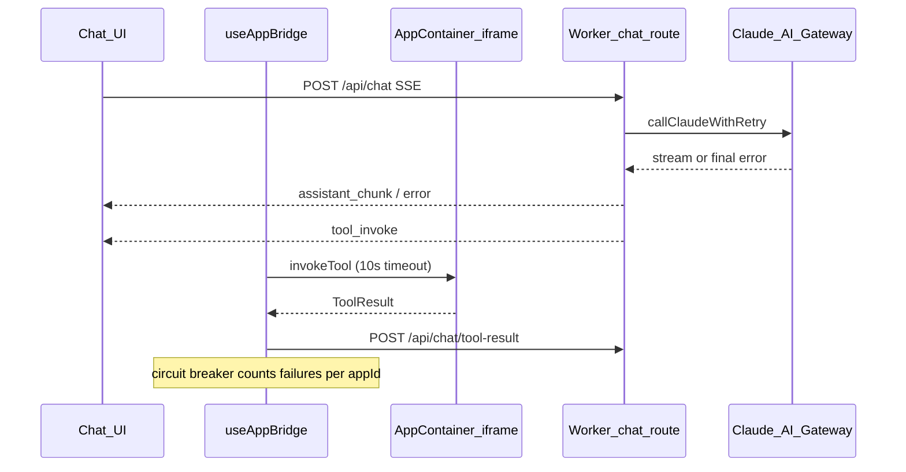

# Phase 7: Error handling and resilience

Source spec: [`.cursor/plans/chatbridgebuildguide.md`](.cursor/plans/chatbridgebuildguide.md) (lines 962–998).

## Current baseline (what already exists)

- [`app/src/components/apps/AppContainer.tsx`](app/src/components/apps/AppContainer.tsx): Loading overlay, Penpal `connect` with `timeout: 5000`, error UI with Retry for **initial** handshake failures only. No iframe load timeout; no distinct “disconnected” state.
- [`app/src/hooks/useAppBridge.ts`](app/src/hooks/useAppBridge.ts): **Already wraps** `invokeTool` in a **10s** `Promise.race` (lines 71–87). Copy should be aligned with the guide (stable `error` string + user-facing `displayText`, ideally using `manifest.name` instead of hardcoding “chess”).
- [`app/src/workers/routes/chat.ts`](app/src/workers/routes/chat.ts): On `!claudeResponse.ok` and stream `catch`, emits SSE `{ type: "error", ... }`. [`app/src/hooks/useChat.ts`](app/src/hooks/useChat.ts) handles `error` events but only `console.error` — **no in-chat UI**.
- [`app/src/workers/claude.ts`](app/src/workers/claude.ts): Single `fetch` to AI Gateway; **no retries**.
- [`app/src/workers/index.ts`](app/src/workers/index.ts): Hono bootstrap only; **not** a good place for “session” state in Workers (isolate lifetime ≠ user session). Per-app failure tracking should live on the **client** (browser tab session) or, later, in D1/DO if you need cross-device truth.

## Implementation plan

### 1. Iframe load failures — [`AppContainer.tsx`](app/src/components/apps/AppContainer.tsx)

- Start a **5s timer** when `src` / `manifest.entry_url` is applied (reset on cleanup). If `load` has not fired, set UI to error with title **“App failed to load”**, `console.error` with manifest id/url, **Retry** clears timer and forces reload (e.g. `iframe.src = manifest.entry_url` or key bump) then re-run `setupConnection` on next `load`.
- Keep existing Penpal handshake timeout (5s) separate from iframe network timeout (5s); document mentally as “shell vs bridge.”
- Note: `<iframe onError>` is **unreliable** cross-browser for navigation failures; treat **timeout + load** as the primary signal (optional `onError` where it fires).

### 2. Tool call timeouts — [`useAppBridge.ts`](app/src/hooks/useAppBridge.ts)

- Keep 10s race; map timeout to the guide’s shape:

  - `error`: `"App did not respond in time"` (stable for logging/analytics).
  - `displayText`: include **dynamic app name** from `activeApp.manifest.name` (pass into `executeInvocation` or read from atom) — same intent as the guide’s chess example without hardcoding.

- Clear the race timer on success (use `AbortController` or explicit `clearTimeout` in a small helper to avoid leaks if you refactor the race).

### 3. Claude API retries — [`claude.ts`](app/src/workers/claude.ts) and/or [`chat.ts`](app/src/workers/routes/chat.ts)

- Add a **`callClaudeWithRetry`** (either next to `callClaude` or only used from `handleChatStream`) that performs up to **3 attempts** with delays **1s, 2s, 4s** before the next attempt.
- **Retry when**: network failure (`fetch` throws), HTTP **429**, and **5xx**. **Do not retry** 4xx (except 429) — surface as final failure.
- On final failure after retries: emit existing SSE `error` with a **generic** message suitable for the UI: e.g. `"Something went wrong. Try again."` (align [`ServerMessage`](app/src/types/index.ts) consumer below).
- Optional stretch: if the **stream** breaks mid-read inside `processOneClaudeStream`, treat as non-retryable unless you want to duplicate the whole turn (larger change); Phase 7 can scope to **initial request** retry only.

### 4. Circuit breaker (per-app, browser session)

- **Do not** use a `Map` in [`index.ts`](app/src/workers/index.ts) for session semantics unless you persist to KV/D1; prefer a small module e.g. [`app/src/lib/appCircuitBreaker.ts`](app/src/lib/appCircuitBreaker.ts) with:
  - Per `appId`: timestamps of failures (or count in rolling **5-minute** window).
  - **≥ 3 failures** → mark **degraded**; before running `executeInvocation`, surface a **warning** (banner in `AppContainer` or inline toast) — “This app has been unstable…”
  - **≥ 10 failures** → **disabled for session**: do not call `invokeTool`; immediately `submitToolResult` with a clear `displayText` so Claude can apologize and suggest alternatives; optionally call `closeApp` or leave panel closed.
- Increment on `ToolResult.success === false` and on timeout; **reset window or decrement bias** on `success: true` (simplest: reset failure list for that `appId` on success).

### 5. Penpal “connection drop” — [`AppContainer.tsx`](app/src/components/apps/AppContainer.tsx)

- Penpal’s public [`Connection`](app/node_modules/penpal/dist/penpal.d.ts) type exposes `promise` and `destroy()` only — **no `on('destroy')`**. Practical approach:
  - Add state **`disconnected`** (or reuse `error` with distinct copy).
  - **Remote teardown**: when `invokeTool` rejects with Penpal’s destroyed/timeout codes (inspect `err` / serialized `penpalCode` if present), transition to disconnected from the imperative handle path — **or** expose `reportTransportFailure(reason)` on `AppContainerHandle` called from `useAppBridge`’s catch.
  - **Parent teardown**: wrap `destroy()` on the handle to reset ready flags (already partially there via `closeApp`).
  - **Restart**: reload iframe + `setupConnection` after `load`.
- **Last known state**: keep a `useRef<AppStateSummary | null>` updated in `notifyStateUpdate`; show one line in the disconnected card (“Last state: …”) for recovery context.

### 6. Graceful degradation + visible chat errors

- **Claude behavior**: extend [`buildSystemPrompt`](app/src/workers/claude.ts) with a short rule: when a tool/app fails or times out, acknowledge it, offer **retry vs something else**, and keep the conversation usable (complements good `displayText` on `ToolResult`).
- **SSE error UX**: add e.g. `streamErrorAtom` in [`app/src/stores/chat.ts`](app/src/stores/chat.ts); set it in [`useChat.ts`](app/src/hooks/useChat.ts) `onError` and network `catch`; render a dismissible banner in [`MessageList.tsx`](app/src/components/chat/MessageList.tsx) or above [`ChatInput`](app/src/components/chat/ChatInput.tsx) with **“Something went wrong. Try again.”** Clear when sending the next message or on dismiss.

## Verification checklist

- Throttle/block `entry_url` in devtools → iframe timeout → error card + retry → recovery.
- Stub slow `invokeTool` in an app → 10s → tool result text reaches Claude; chat continues after tool-result round-trip.
- Temporarily break Anthropic/Gateway (or mock 503) → retries logged → user sees banner.
- Force repeated tool failures → degraded warning → after 10, synthetic failure without hanging chat.

## Out of scope (later phases)

- Phase 8 DO/WebSocket will change transport but the same error shapes (`ServerMessage`, `ToolResult`) should stay compatible.
