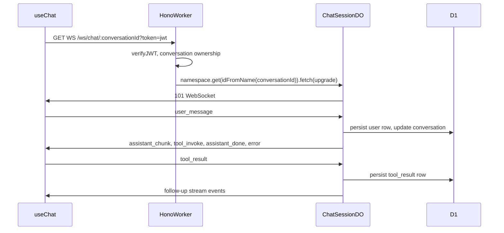

# Phase 8: Durable Object WebSocket upgrade

**Spec source:** [`.cursor/plans/chatbridgebuildguide.md`](.cursor/plans/chatbridgebuildguide.md) (lines 1002–1059).

## Baseline

- [`app/src/workers/index.ts`](app/src/workers/index.ts): `ChatSession` is a stub returning plain text; `CHAT_SESSION` binding already exists in [`app/wrangler.jsonc`](app/wrangler.jsonc) with `new_sqlite_classes` for SQLite-backed DO.
- [`app/src/workers/routes/chat.ts`](app/src/workers/routes/chat.ts): `handleChatStream`, `processOneClaudeStream`, `loadChatContext`, D1 persistence, and `list_available_apps` server-side loop — all SSE-specific via `formatSSEEvent` + `WritableStreamDefaultWriter`.
- [`app/src/hooks/useChat.ts`](app/src/hooks/useChat.ts): Only `apiStream` → `POST /api/chat` and `/api/chat/tool-result` + [`consumeSSEStream`](app/src/hooks/useChat.ts).
- [`app/src/types/index.ts`](app/src/types/index.ts): `ClientMessage` / `ServerMessage` already match WS payload shapes (no type churn required beyond any new control events you add, e.g. `connected`).
- Auth today is **Bearer-only** in [`app/src/workers/middleware/auth.ts`](app/src/workers/middleware/auth.ts); browsers cannot set custom headers on `WebSocket`, so the Worker upgrade route must accept **JWT via query** (e.g. `?token=`) after the same `verifyJWT` logic, then strip it from what you forward if needed.

## Architecture

## Step 1 — Refactor shared chat engine (avoid duplicating Phase 2–7 logic)

**Goal:** One implementation of “load context → call Claude → stream deltas → save D1 → emit tool_invoke / done / error” used by both SSE routes and the DO.

- Extract from [`chat.ts`](app/src/workers/routes/chat.ts) into a module e.g. [`app/src/workers/lib/chat-pipeline.ts`](app/src/workers/lib/chat-pipeline.ts) (names flexible):
  - `processOneClaudeStream` — replace direct `writer.write(formatSSEEvent(...))` with an **`emit(event: ServerMessage)`** (or equivalent callback) so the same parser drives both transports.
  - `handleChatStream` — take `emit` instead of `(writer, encoder)`; keep all D1/KV behavior, `callClaudeWithRetry`, `maxIterations`, tool partitioning unchanged.
  - Keep **route-only** concerns in `chat.ts`: conversation ownership checks, `getNextSeqNum`, initial `saveMessage` for POST bodies, `createSSEResponse`, wrapping `emit` with `formatSSEEvent` + `writer.write`.

This is the highest-leverage change: it keeps retries, system prompt, and tool routing identical between SSE and WS.

## Step 2 — `ChatSession` Durable Object ([`chat-session.ts`](app/src/workers/chat-session.ts))

**Move** the class out of `index.ts` into `chat-session.ts` and **re-export** from [`app/src/workers/index.ts`](app/src/workers/index.ts) so Wrangler’s `class_name: "ChatSession"` keeps resolving.

**Hibernatable WebSockets:** Follow Cloudflare’s Durable Object WebSocket hibernation API (`acceptWebSocket` / `webSocketMessage` / `webSocketClose` / `webSocketError` — exact names per current Workers types). Ensure idle connections can hibernate without billing duration continuously.

**`fetch` handler:**

- If `Upgrade: websocket`, accept the socket and return `101`.
- Otherwise `405` or `404`.

**Inbound messages (align with existing [`ClientMessage`](app/src/types/index.ts)):**

- `user_message`: Same persistence as [`chat.post("/")`](app/src/workers/routes/chat.ts) (insert user message, bump `conversations.updated_at`), then `loadChatContext` and call shared `handleChatStream` with `emit` = `ws.send(JSON.stringify(msg))` (and try/catch closed socket).
- `tool_result`: Same as [`chat.post("/tool-result")`](app/src/workers/routes/chat.ts) (insert `tool_result` row), reload context, run `handleChatStream`.

**Auth / user identity:** Do **not** trust client-sent `userId`. Options (pick one, both valid):

- **A (recommended):** Worker route validates JWT + conversation, then forwards upgrade to DO with a **signed internal header** (e.g. `X-ChatBridge-UserId`) that only your Worker sets; DO reads it for `callClaudeWithRetry({ userId })`.
- **B:** Pass `userId` in a short-lived signed query param from the Worker.

**Embedded SQLite (`ctx.storage.sql`) — per guide:**

- In DO `constructor` / first-run migration, create tables: `session_messages`, `active_apps`, `pending_tool_calls` (schemas minimal but forward-looking).
- **Dual-write strategy:** On each message mutation that today hits D1, also upsert/insert into DO SQLite so eviction (~30s idle) still leaves durable session state in storage.
- **Hydration:** On wake, if local cache is empty (or sequence mismatch), bulk-load from D1 for this `conversationId` and backfill SQLite — so the “cache avoids D1 roundtrip per turn” property holds after cold start.
- **`pending_tool_calls`:** When emitting `tool_invoke`, record row; clear when `tool_result` received — helps reason about half-open tool rounds after reconnect (even if the client still uses REST fallback for edge cases).

**Concurrency:** If multiple WebSockets attach to the same DO, define behavior explicitly: **MVP** — attach all accepted sockets to the same DO instance and **broadcast** each `ServerMessage` to every open socket (simple multi-tab), or reject second socket — choose one and document in code comment.

## Step 3 — Worker route `/ws/chat/:conversationId`

- Add a small route module (e.g. [`app/src/workers/routes/ws-chat.ts`](app/src/workers/routes/ws-chat.ts)) **or** inline in `index.ts` **before** generic `app.onError`.
- Steps: parse `conversationId` from path; read JWT from `?token=`; `verifyJWT` (reuse [`app/src/workers/lib/crypto.ts`](app/src/workers/lib/crypto.ts)); load `conversations.user_id` and compare to `payload.userId`; `403` on failure.
- `const id = env.CHAT_SESSION.idFromName(conversationId); return env.CHAT_SESSION.get(id).fetch(requestWithInternalHeaders)`.
- Register `app.use("/ws/chat/*", …)` only if you need CORS — WS upgrades typically don’t need the same CORS middleware as `/api/*`; avoid applying Bearer-middleware that would block WS.

[`wrangler.jsonc`](app/wrangler.jsonc) already has `"run_worker_first": ["/api/*", "/ws/*"]` — no change expected for routing.

## Step 4 — Frontend [`useChat.ts`](app/src/hooks/useChat.ts)

- When `activeConversationId` is set, open `WebSocket` to same origin: `wss?` derived from `window.location` (or Vite dev equivalent — `@cloudflare/vite-plugin` should align with how `/api` is reached today).
- URL: `/ws/chat/${conversationId}?token=${encodeURIComponent(getAuthToken() ?? "")}` — handle missing token like today’s API calls.
- **Send:** `user_message` / `tool_result` as JSON (same shapes as today’s POST bodies conceptually).
- **Receive:** parse JSON lines as `ServerMessage`; reuse the same switch as `consumeSSEStream` (`assistant_chunk`, `tool_invoke`, `assistant_done`, `error`) to update Jotai atoms.
- **Fallback:** If `WebSocket` fails to open or errors before `open`, fall back to existing `apiStream` + SSE path for that turn (per guide).
- **Reconnection:** On abnormal close, retry up to **3** times with exponential backoff (e.g. 1s / 2s / 4s); on success, optionally **refetch** conversation messages from existing GET conversation endpoint ([`conversations` route](app/src/workers/routes/conversations.ts)) to reconcile UI if a partial stream occurred — keeps behavior predictable.
- **Lifecycle:** Close socket when conversation changes or on unmount; reset retry state when `conversationId` changes.

## Step 5 — Verification

- Local: open chat, send message over WS, confirm streaming + `assistant_done` and DB rows match SSE path.
- Tool flow: trigger `tool_invoke`, complete via iframe, confirm `tool_result` over WS and follow-up stream.
- Kill WS mid-stream, confirm fallback or reconnect path doesn’t duplicate messages (may require refetch merge logic for temp user message ids — same issue as today with `temp-*` user rows).
- Confirm DO hibernation: idle tab, send next message, still works after wake (hydration path).

## Risks / decisions

- **Token in query:** Logs and Referer can leak `?token=` — acceptable for many internal MVPs; mitigation is short-lived tokens or first-message auth in a follow-up.
- **Scope:** Full SQLite mirror + hydration is the bulk of Phase 8; if time-boxed, ship WS + shared pipeline + D1-only inside DO first, then add SQLite tables and dual-write in a second pass (guide prefers full spec in one phase).
