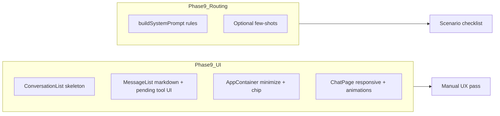

# Phase 9: Polish

**Spec source:** [`.cursor/plans/chatbridgebuildguide.md`](.cursor/plans/chatbridgebuildguide.md) (lines 1063–1116).

## Current baseline (what already exists)

- **Typing indicator:** [`app/src/components/chat/MessageList.tsx`](app/src/components/chat/MessageList.tsx) already shows three bouncing dots when `isStreaming && !streamingText`.
- **Tool lines in history:** `tool_call` rows render as centered “Using {toolName}...” pills (same intent as the guide’s “[Using Chess...]”).
- **App iframe loading:** [`app/src/components/apps/AppContainer.tsx`](app/src/components/apps/AppContainer.tsx) has a spinner overlay (“Loading {name}...”) and a header with app name + close only.
- **System prompt:** [`app/src/workers/claude.ts`](app/src/workers/claude.ts) `buildSystemPrompt` already states prefer active app tools, answer without tools when no match, and `list_available_apps` flow — **missing** the explicit “ambiguous → ask clarification” rule from the guide.
- **Deps:** [`app/package.json`](app/package.json) has no `react-markdown` / highlighter packages yet.

## Step 9.1 — UI polish

### Loading and streaming affordances

- **Conversation list:** [`app/src/components/chat/ConversationList.tsx`](app/src/components/chat/ConversationList.tsx) loads conversations in `useEffect` with no `loading` flag — add local loading state, show **skeleton rows** until the first fetch settles, and optionally a subtle error/retry if the fetch fails.
- **Tool invocation progress:** [`app/src/stores/chat.ts`](app/src/stores/chat.ts) exposes `pendingToolCallAtom`, set on `tool_invoke` in [`app/src/hooks/useChat.ts`](app/src/hooks/useChat.ts), but **nothing reads it in the UI**. Use it in `MessageList` (or a thin child) to show a **shimmer / indeterminate bar** or inline “Running tool…” while the iframe round-trip is in progress; clear it when the turn completes or errors (audit `useChat` / `useAppBridge` so it doesn’t stick after `assistant_done`).

### App container and page layout

- **Chrome:** Extend [`AppContainer.tsx`](app/src/components/apps/AppContainer.tsx): add **minimize** (collapses UI), keep **close**, optional subtle **shadow/border** on the outer shell. “Chip at bottom of chat” implies **lifted state** from the container into [`ChatPage.tsx`](app/src/pages/ChatPage.tsx) (or a small `useAppPanel` hook + jotai atom): when minimized, render a fixed **bottom chip** (app name + expand + close) and hide the tall panel; when expanded, show the full iframe column again.
- **Slide-in:** Animate the app column (e.g. Tailwind `transition` + `translate` or CSS keyframes) when `activeApp` becomes non-null in `ChatPage`.
- **Token alignment:** Sidebar uses theme tokens (`bg-surface`, `border-border`); `ChatPage` uses raw `bg-gray-950` / `border-gray-800` — align the main shell and app rail to **`@theme` variables** from [`app/src/index.css`](app/src/index.css) for consistent dark UI.

### Message rendering

- Add **`react-markdown`** (and **`remark-gfm`** if you want tables/task lists) for **assistant** bubbles only; keep **user** messages plain or lightly escaped to avoid XSS from user text.
- Add syntax highlighting: **`react-syntax-highlighter`** (or lighter **`shiki`** if bundle size matters — pick one and document in the plan execution). Wrap fenced code in a styled `<pre>` consistent with `surface-alt` / borders.
- **Fade-in:** Apply a short `animate-in` / opacity transition on new `MessageBubble` rows (CSS in `index.css` or Tailwind arbitrary animation).

### Responsive behavior

- **Today:** [`ChatPage.tsx`](app/src/pages/ChatPage.tsx) is a single horizontal flex: fixed `w-64` sidebar + chat + optional `w-[350px]` app rail — poor on narrow viewports.
- **Target:** Use breakpoints (`md:`): on small screens, **hide** the conversation rail behind a **hamburger** toggle (state in `ChatPage` or jotai); overlay or slide-in drawer for the list. When an app is open on small screens, stack **messages + input above** and **iframe full-width below** (flex-col), instead of a 350px side column.

## Step 9.2 — Multi-app routing

- **Primary change:** In [`buildSystemPrompt`](app/src/workers/claude.ts), add an explicit rule matching the guide: when multiple apps could apply, **ask a short clarifying question** before calling app tools; when none match, answer directly; when one session is active, **bias tool choice** to that app for ambiguous follow-ups; when the user asks to **switch** apps (e.g. stop chess, open weather), **close/switch** via the appropriate tools rather than stacking confusion.
- **Optional tightening:** Adjust `LIST_APPS_TOOL` description in the same file so it doesn’t encourage listing on every turn — only when discovery is needed.
- **Validation:** Manually run the guide’s scenarios (chess, weather, ambiguous, arithmetic, mid-game context, explicit switch). If the model still mis-routes, add **2–4 few-shot lines** inside `buildSystemPrompt` (not a new file) illustrating correct behavior.

## Dependency / bundle note

- `react-syntax-highlighter` pulls a large highlighter bundle; if `vite build` size or LCP regressions appear, prefer **`shiki`** + async load or a minimal language set. Keep the implementation choice in one place (e.g. a `MarkdownMessage` component).

## Out of scope

- Phase 10 deploy and Phase 11 docs (separate phases in the guide).

