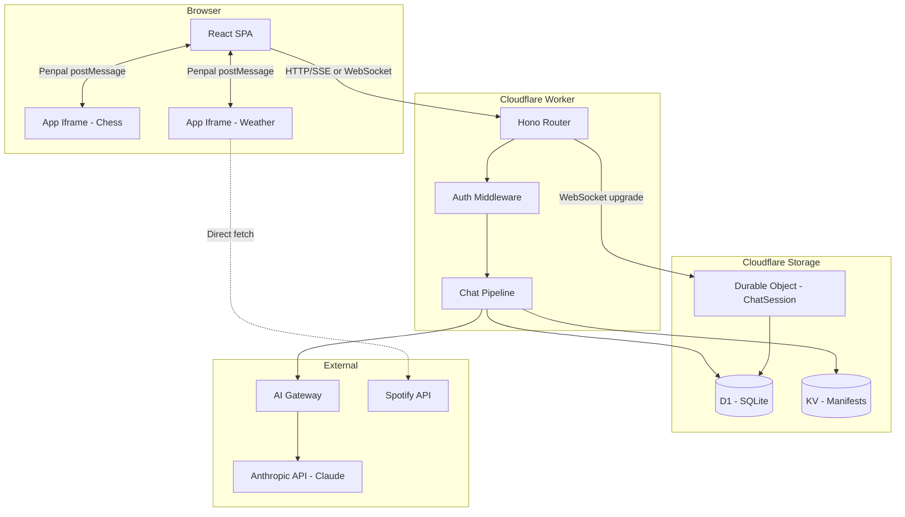
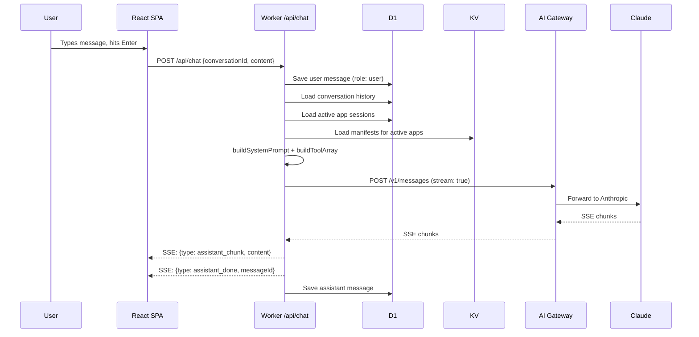
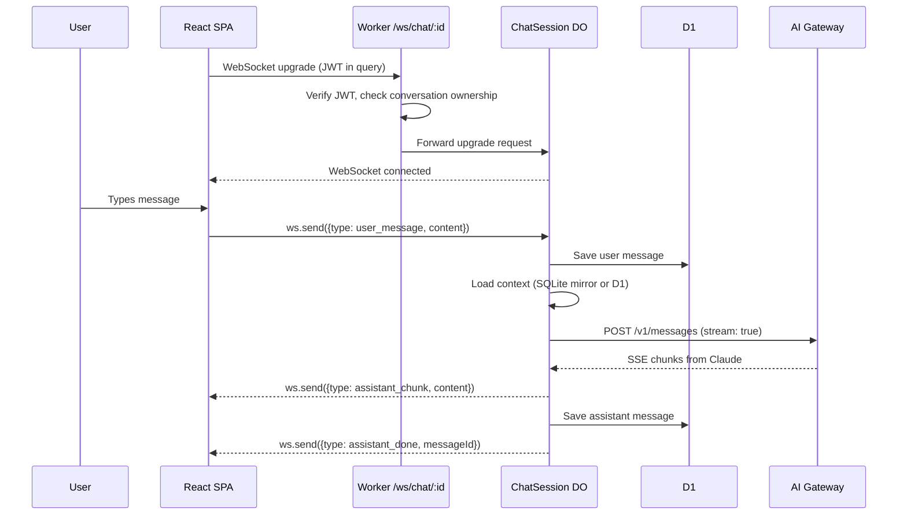
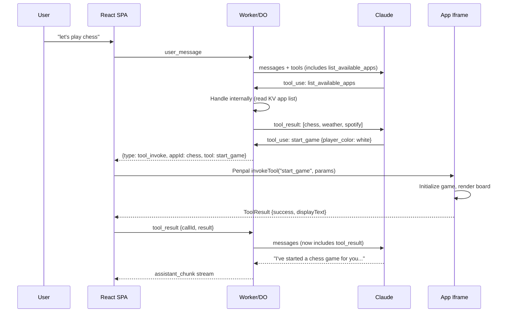

# ChatBridge Architecture

## System Overview



The platform is a single Cloudflare Worker serving both the Vite-built SPA (static assets) and the API. The `run_worker_first` rule in `wrangler.jsonc` routes `/api/*` and `/ws/*` to the Worker; everything else serves the SPA with single-page-application fallback.

Apps run on separate origins (Cloudflare Pages) and communicate with the platform exclusively through Penpal's `postMessage` bridge.

## Request Flow: User Message to Response

### HTTP/SSE path (fallback)



### WebSocket path (primary, via Durable Object)



The WebSocket path avoids per-message HTTP overhead and enables the Durable Object to maintain a SQLite mirror of the conversation for faster context loading on subsequent turns.

## Tool Invocation Lifecycle

When Claude decides to use an app tool, this 11-step chain executes:



Key details:

1. `list_available_apps` is always in Claude's tool array. It returns app metadata from KV.
2. After discovering apps, Claude's next call includes the selected app's full tool schemas (lazy loading -- tools aren't loaded until needed).
3. The `tool_invoke` event travels from Worker to client via SSE/WebSocket, then from client to iframe via Penpal.
4. The iframe executes the tool and returns a `ToolResult` with a `displayText` field that Claude uses to formulate its natural-language response.
5. The round-trip continues until Claude produces a final text response (no more tool calls).

## State Management

### Storage layers

| Layer | Technology | What it stores | Durability | Access speed |
|-------|-----------|---------------|------------|-------------|
| Client | Jotai atoms | UI state, streaming messages, active sessions | Session only | Instant |
| Hot cache | DO embedded SQLite | Conversation messages, active apps, pending tool calls | Survives DO eviction/wake | ~1ms (in-memory) |
| Source of truth | D1 (SQLite) | All persistent data: users, apps, conversations, messages, sessions, tokens | Permanent | ~5-20ms |
| Manifests | KV | App manifests, app list index | Permanent, eventually consistent | ~1ms (edge cached) |

### Data flow

- **Writes** always go to D1 first (source of truth), then the DO SQLite mirror is updated.
- **Reads** during an active WebSocket session prefer DO SQLite (avoids D1 round-trip). If the DO wakes from hibernation, it rehydrates from D1.
- **Manifest reads** always go to KV. Manifests are written on app registration and read on every Claude call that needs tool schemas.
- **Client atoms** are populated from API responses and updated optimistically during streaming.

### D1 Schema

Six tables with four indexes:

- `users` -- Accounts with PBKDF2-hashed passwords.
- `apps` -- Registered apps with status tracking.
- `conversations` -- Per-user conversations.
- `messages` -- All messages (user, assistant, tool_call, tool_result, system) ordered by `sequence_num`.
- `app_sessions` -- Lifecycle tracking for app instances within conversations.
- `app_tokens` -- Encrypted OAuth tokens per user per app.

Full schema: `app/migrations/0001_initial.sql`.

## Transport

### Message types

**Client to server** (`ClientMessage`):

```typescript
type ClientMessage =
  | { type: "user_message"; content: string }
  | { type: "tool_result"; callId: string; result: ToolResult };
```

**Server to client** (`ServerMessage`):

```typescript
type ServerMessage =
  | { type: "assistant_chunk"; content: string }
  | { type: "tool_invoke"; callId: string; appId: string; tool: string; params: unknown }
  | { type: "assistant_done"; messageId: string }
  | { type: "error"; message: string; retryable: boolean };
```

### SSE vs WebSocket

| Feature | SSE (HTTP) | WebSocket (DO) |
|---------|-----------|----------------|
| Transport | POST + streaming response | Persistent bidirectional |
| Auth | Bearer JWT header | JWT in query param on upgrade |
| State | Stateless (loads from D1 each turn) | Stateful (DO SQLite mirror) |
| Multi-tab | Independent streams | All tabs share DO broadcast |
| Reconnect | Client retries POST | Auto-reconnect with backoff (3 attempts) |
| Use case | Fallback when WS unavailable | Primary transport |

The frontend tries WebSocket first. If the connection fails, it falls back to SSE endpoints (`POST /api/chat` and `POST /api/chat/tool-result`).

## AI Gateway Integration

All Claude API calls route through Cloudflare AI Gateway at:

```
https://gateway.ai.cloudflare.com/v1/{CF_ACCOUNT_ID}/{AI_GATEWAY_ID}/anthropic/v1/messages
```

### Headers

| Header | Value | Purpose |
|--------|-------|---------|
| `x-api-key` | Anthropic API key | Anthropic authentication |
| `cf-aig-authorization` | AI Gateway token | Gateway authentication |
| `cf-aig-metadata` | JSON `{ userId, appId, hasToolSchemas }` | Per-request tagging for analytics |
| `anthropic-version` | `2023-06-01` | Anthropic API version |

### Retry strategy

`callClaudeWithRetry` in `claude.ts` retries on 429 (rate limit) and 5xx errors:

- 3 attempts max
- Exponential backoff: 1s, 2s, 4s
- Non-retryable errors (400, 401, 403) fail immediately

### Gateway features used

- **Analytics**: Token usage, cost, latency per request, tagged by user and app.
- **Rate limiting**: Configurable per-user limits at the gateway level.
- **Caching**: Identical requests return cached responses (reduces cost for repeated queries).
- **Logging**: Full request/response logging for debugging.

## Security Model

### Iframe sandboxing

Apps run in iframes with restrictive `sandbox` attributes:

```html
<iframe sandbox="allow-scripts allow-forms allow-popups allow-popups-to-escape-sandbox"
        allow="clipboard-write"
        referrerpolicy="no-referrer">
```

- No access to the parent page's DOM, cookies, or localStorage.
- No top-level navigation.
- `allow-same-origin` is only added when the app manifest explicitly requests it (needed for apps that call external APIs).
- Each app runs on a separate Cloudflare Pages origin, providing origin isolation between apps and the platform.

### Authentication

- **Passwords**: Hashed with PBKDF2 (Web Crypto API) using per-user random salts. Stored as `salt:hash` in D1.
- **JWTs**: Signed with HS256 via Web Crypto API. 7-day expiry. Payload: `{ userId, email, iat, exp }`.
- **OAuth tokens**: Encrypted before storage in D1's `app_tokens` table. Refresh is handled server-side; apps never see refresh tokens.

### Communication isolation

- Platform-to-app communication uses Penpal (`postMessage`) only. No shared memory, no direct DOM access.
- Apps cannot read the user's JWT or any platform secrets.
- The platform validates all tool results before forwarding to Claude.

### Error containment

- App iframe failures don't crash the chat. The platform shows an error card with retry.
- Tool call timeouts (10s) return error `ToolResult` to Claude, which explains the failure conversationally.
- Circuit breaker: 3 failures in 5 minutes marks an app as "degraded"; 10 failures auto-disables it for the session.

## Key Files

| Concept | File |
|---------|------|
| Worker entry + route wiring | `src/workers/index.ts` |
| Auth middleware (JWT verify) | `src/workers/middleware/auth.ts` |
| Auth routes (register/login) | `src/workers/routes/auth.ts` |
| Chat HTTP/SSE route | `src/workers/routes/chat.ts` |
| WebSocket route | `src/workers/routes/ws-chat.ts` |
| Conversation CRUD | `src/workers/routes/conversations.ts` |
| App registration + listing | `src/workers/routes/apps.ts` |
| App session lifecycle | `src/workers/routes/app-sessions.ts` |
| Spotify OAuth routes | `src/workers/routes/oauth-spotify.ts` |
| Claude API client | `src/workers/claude.ts` |
| Shared chat pipeline (SSE + WS) | `src/workers/lib/chat-pipeline.ts` |
| Crypto utilities (PBKDF2, JWT) | `src/workers/lib/crypto.ts` |
| SSE helpers | `src/workers/lib/sse.ts` |
| Durable Object (ChatSession) | `src/workers/chat-session.ts` |
| All TypeScript interfaces | `src/types/index.ts` |
| D1 migration | `migrations/0001_initial.sql` |
| Wrangler config | `wrangler.jsonc` |
